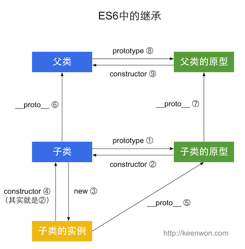
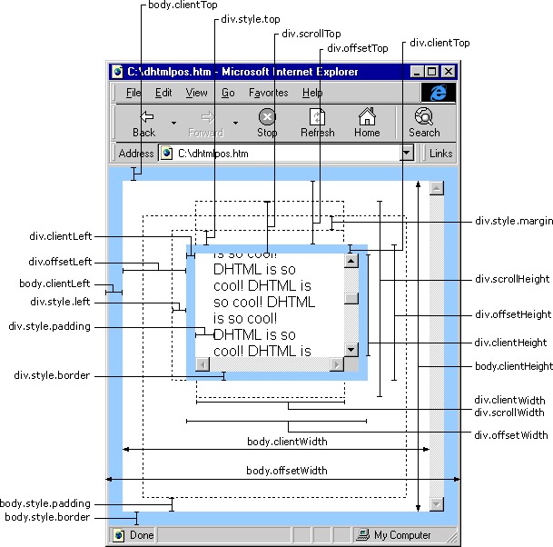
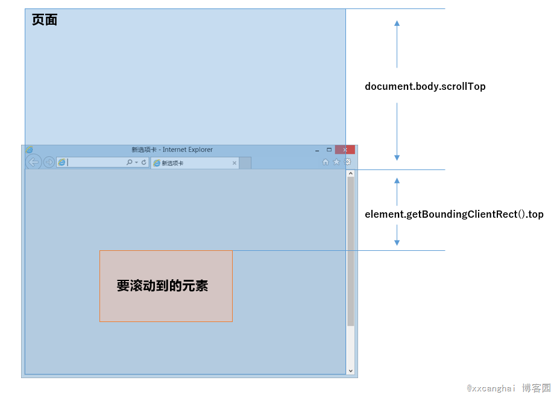
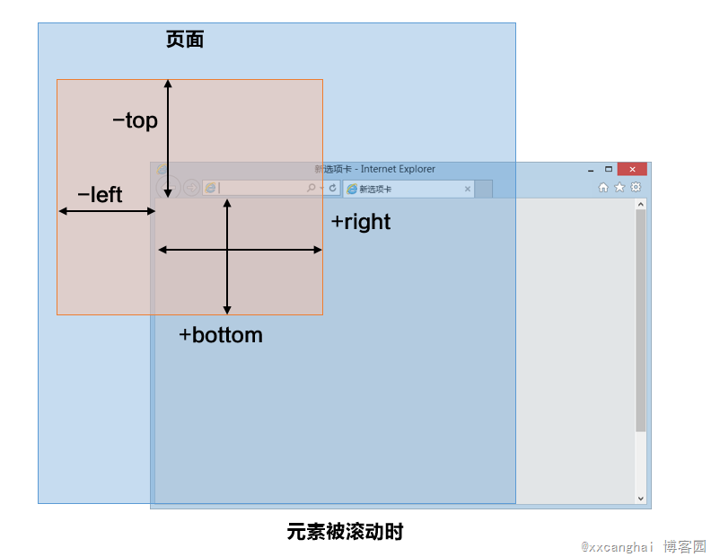

 ## 设置缓存
 
手机页面通常在第一次加载后会进行缓存，然后每次刷新会使用缓存而不是去重新向服务器发送请求。如果不希望使用缓存可以设置no-cache。
`<meta http-equiv="Cache-Control" content="no-cache" />`
 
## IOS中input键盘事件keyup、keydown、keypress支持不是很好
 
问题是这样的，用input search做模糊搜索的时候，在键盘里面输入关键词，会通过ajax后台查询，然后返回数据，然后再对返回的数据进行关键词标红。用input监听键盘keyup事件，在安卓手机浏览器中是可以的，但是在ios手机浏览器中变红很慢，用输入法输入之后，并未立刻相应keyup事件，只有在通过删除之后才能相应！
 
可以用html5的oninput事件去代替keyup
 
```js
document.getElementById('id').addEventListener('input', function(e){ })
```
 
## ios 设置input 按钮样式会被默认样式覆盖
 
```css
input, textarea { border: 0; -webkit-appearance: none; }
```
 
## css3 mask
 
## 通过transform进行skew变形，rotate旋转会造成出现锯齿现象
 
```css
{
    -webkit-transform: rotate(-4deg) skew(10deg) translateZ(0);
    transform: rotate(-4deg) skew(10deg) translateZ(0);
    outline: 1px solid rgba(255,255,255,0)
}
```
 
## click 与 tap 的区别 待拓展
 
click有300s延迟性，可能会点击穿透。
使用touch事件来替换click事件。
用fastclick
tap 其实是touch事件的扩展
 
## 消除 IE10 里面的那个叉号
 
`input:-ms-clear{display:none;}`
 
## 移动端 HTML5 audio autoplay 失效问题
 
这个不是 BUG，由于自动播放网页中的音频或视频，会给用户带来一些困扰或者不必要的流量消耗，所以苹果系统和安卓系统通常都会禁止自动播放和使用 JS 的触发播放，必须由用户来触发才可以播放。
解决方法思路：先通过用户 touchstart 触碰，触发播放并暂停（音频开始加载，后面用 JS 再操作就没问题了）。
 
```js
document.addEventListener('touchstart', function () { 
    document.getElementsByTagName('audio')[0].play()
    document.getElementsByTagName('audio')[0].pause() 
})
```
 
## 唤起select的option展开
 
```js
function showDropdown(sltElement) {
  var event;
  event = document.createEvent('MouseEvents')
  event.initMouseEvent('mousedown', true, true, window)
  sltElement.dispatchEvent(event)
}
```
 
# 关于DOM级别
 
[待拓展](http://www.cnblogs.com/hyaaon/p/4623613.html)
 
> DOM0级标准是不存在的，所谓的DOM0级是DOM历史坐标中的一个参照点而已
 
0. DOM0级指的是IE4和Netscape 4.0这些浏览器最初支持的DHTML
1. DOM1级（DOM Level 1）于1998年10月成为W3C的推荐标准。DOM1级由两个模块组成：DOM核心（DOM Core）和DOM HTML。其中，DOM核心规定的是如何映射基于XML的文档结构，以便简化对文档中任意部分的访问和操作。DOM HTML模块则在DOM核心的基础上加以扩展，添加了针对HTML的对象和方法。
2. DOM2级在原来DOM的基础上又扩充了（DHTML一直都支持的）鼠标和用户界面事件、范围、遍历（迭代DOM文档的方法）等细分模块，而且通过对象接口增加了对CSS（Cascading Style Sheets，层叠样式表）的支持。DOM1级中的DOM核心模块也经过扩展开始支持XML命名空间
3. DOM3级则进一步扩展了DOM，引入了以统一方式加载和保存文档的方法–在DOM加载和保存（DOM Load and Save）模块中定义；新增了验证文档的方法–在DOM验证（DOM Validation）模块中定义。DOM3级也对DOM核心进行了扩展，开始支持XML 1.0规范，涉及XML Infoset、XPath和XML Base。
 
# 事件模型及事件代理/委托
 
## 事件流
 
DOM2级事件模型中规定了事件流的三个阶段：捕获阶段、目标阶段、冒泡阶段，低版本IE（IE8及以下版本）不支持捕获阶段
 
* 捕获事件流：Netscape提出的事件流，即事件由页面元素接收，逐级向下，传播到最具体的元素。
 
* 冒泡事件流：IE提出的事件流，即事件由最具体的元素接收，逐级向上，传播到页面。
 
* 目前支持以addEventListener绑定事件的浏览器：FF、Chrome、Safari、Opera、IE9-11
 
* 目前支持以attachEvent绑定事件的浏览器：IE6-10
 
> 综合测试结果，preventDefault和returnValue的兼容性如下（T：支持该属性或事件且结果正确；F：不支持该属性或事件或结果不正确：—：不支持该事件绑定方式）
 
|函数名|    事件绑定方式    |事件流|    FF|    Chrome|    Opera|    Safari|    模拟IE8|    模拟IE9|    模拟IE10|    IE11|
|:--:|:--:|:--:|:--:|:--:|:--:|:--:|:--:|:--:|:--:|:--:|
|preventDetault()|    element.on[type] = fn|    冒泡|    T|    T    |T|    T|    F|    T|    T|    T|
||addEventListener()|    捕获|    T|    T|    T|    T|    —|    T|    T|    T|
|||冒泡|    T    |T    |T|    T    |—    |T|    T|    T|
||attachEvent()    |冒泡    |—    |—|    —|    —|    F|    F|    F|    —|
|returnValue=false|    element.on[type] = fn|    冒泡|    F|    T    |T|    T|    T|    F|    F|    F|
||addEventListener()|    捕获    |F|    T|    T|    T    |—    |F    |F    |F|
|||冒泡|    F|    T|    T|    T|    —|    F    |F|    F|
||attachEvent()|    冒泡|    —|    —|    —    |—|    T|    F|    F|    —|
 
## IE和W3C不同绑定事件解绑事件的方法有什么区别，参数分别是什么，以及事件对象e有什么区别
 
W3C：`target.addEventListener(event, listener, useCapture);`
 
`event`事件类型；`listener`事件触发时执行的函数；`useCapture`指定事件是否在捕获或冒泡阶段执行，为true时事件句柄在捕获阶段执行，为`false`（默认`false`）时，事件句柄在冒泡阶段执行。
 
```js
btn.addEventListener('click', function() {
//do something...
}, false)
```
 
对应的事件移除
 
```js
removeEventListener(event, function, capture/bubble)
```
 
IE：`target.attachEvent(type, listener);`
 
`type`字符串，事件名称，含`on`，比如`onclick`、`onmouseover`、`onkeydown`等。 `listener`实现了 `EventListener` 接口或者是 JavaScript 中的函数。
 
```js
btn.attachEvent('onclick', function() {
//do something...
})
```
 
对应的事件移除
 
```js
detachEvent(event, function)
```
 
## 事件的委托（代理 Delegated Events）的原理以及优缺点
 
委托（代理）事件是那些被绑定到父级元素的事件，但是只有当满足一定匹配条件时才会被挪。这是靠事件的冒泡机制来实现的，优点是：
 
1. 可以大量节省内存占用，减少事件注册，比如在table上代理所有td的click事件就非常棒
2. 可以实现当新增子对象时无需再次对其绑定事件，对于动态内容部分尤为合适
 
缺点是：
 
1. 事件代理的应用常用应该仅限于上述需求下，如果把所有事件都用代理就可能会出现事件误判，即本不应用触发事件的被绑上了事件
 
例子：
 
```js
var toolbar = document.querySelector(".toolbar");
toolbar.addEventListener("click", function(e) {
  var button = e.target;
  if(!button.classList.contains("active"))
    button.classList.add("active");
  else
    button.classList.remove("active");
});
```
 
## 手写原生js实现事件代理，并要求兼容浏览器
 
```js
// ============ 简单的事件委托
function delegateEvent(interfaceEle, selector, type, fn) {
    if(interfaceEle.addEventListener){
    interfaceEle.addEventListener(type, eventfn);
    }else{
    interfaceEle.attachEvent("on"+type, eventfn);
    }
     
    function eventfn(e){
    var e = e || window.event;    
    var target = e.target || e.srcElement;
    if (matchSelector(target, selector)) {
            if(fn) {
                fn.call(target, e);
            }
        }
    }
}
/**
* only support #id, tagName, .className
* and it's simple single, no combination
*/
function matchSelector(ele, selector) {
    // if use id
    if (selector.charAt(0) === "#") {
        return ele.id === selector.slice(1);
    }
    // if use class
    if (selector.charAt(0) === ".") {
        return (" " + ele.className + " ").indexOf(" " + selector.slice(1) + " ") != -1;
    }
    // if use tagName
    return ele.tagName.toLowerCase() === selector.toLowerCase();
}
//调用
var odiv = document.getElementById("oDiv");
delegateEvent(odiv,"a","click",function(){
    alert("1");
})
```
 
## 实现事件模型`events`
 
大致实现思路就是创建一个类或是匿名函数，在bind和trigger函数外层作用域创建一个字典对象，用于存储注册的事件及响应函数列表，bind时，如果字典没有则创建一个，key是事件名称，value是数组，里面放着当前注册的响应函数，如果字段中有，那么就直接push到数组即可。trigger时调出来依次触发事件响应函数即可。
 
```js
var Emitter=function(){
    this._listeners = {} }
//注册事件
Emitter.prototype.on = function(eventName, callback) {
     var listeners = this._listeners[eventName]||[]
     listeners.push(callback)
     this._listeners[eventName]=listeners
}
//触发事件
Emitter.prototype.emit = function(eventName) {
    var args = Array.prototype.slice.apply(arguments).slice(1),
        listeners = this._listeners[eventName],
        self = this
    if (!Array.isArray(listeners))
        return
    listeners.forEach(function(callback) {
        try{
            callback.apply(this,args)
        } catch(e) {
            console.error(e)
        } 
    })
}
//实例
var emitter=new Emitter()
emitter.on('event', function(arg1, arg2){
    console.log('get event',arg1,arg2)
})
console.log('emit event')
emitter.emit('event', 'arg1', 'arg2')
```
 
## 事件如何派发也就是事件广播（dispatchEvent）
 
一般我们在元素上绑定事件后，是靠用户在这些元素上的鼠标行为来捕获或者触发事件的，或者自带的浏览器行为事件，比如click，mouseover，load等等，有些时候我们需要自定义事件或者在特定的情况下需要触发这些事件。这个时候我们可以使用IE下fireEvent方法，高级浏览器（chrome,firefox等）有dispatchEvent方法。
 
ie下的例子：
 
```js
//document上绑定自定义事件ondataavailable
document.attachEvent('ondataavailable', function (event) {
    alert(event.eventType);
});
var obj=document.getElementById("obj");
//obj元素上绑定click事件
obj.attachEvent('onclick', function (event) {
alert(event.eventType);
});
//调用document对象的createEventObject方法得到一个event的对象实例。
var event = document.createEventObject();
event.eventType = 'message';
//触发document上绑定的自定义事件ondataavailable
document.fireEvent('ondataavailable', event);
//触发obj元素上绑定click事件
document.getElementById("test").onclick = function () {
    obj.fireEvent('onclick', event);
};
```
 
高级浏览器（chrome,firefox等）的例子：
 
```js
//document上绑定自定义事件ondataavailable
document.addEventListener('ondataavailable', function (event) {
    alert(event.eventType);
}, false);
var obj = document.getElementById("obj");
//obj元素上绑定click事件
obj.addEventListener('click', function (event) {
    alert(event.eventType);
}, false);
//调用document对象的 createEvent 方法得到一个event的对象实例。
var event = document.createEvent('HTMLEvents');
// initEvent接受3个参数：
// 事件类型，是否冒泡，是否阻止浏览器的默认行为
event.initEvent("ondataavailable", true, true);
event.eventType = 'message';
//触发document上绑定的自定义事件ondataavailable
document.dispatchEvent(event);
var event1 = document.createEvent('HTMLEvents');
event1.initEvent("click", true, true);
event1.eventType = 'message';
//触发obj元素上绑定click事件
document.getElementById("test").onclick = function () {
    obj.dispatchEvent(event1);
};
 
```
 
# 知识点
 
* ~~闭包~~
* ~~this(call/apply)~~
* es6[新特性 Promise 箭头函数 Class 如何让引入js 原型 构造函数]
* vuejs[优点 特点 用到什么 路由 vuex(各组件之间的通讯) MVVM 尤 https://github.com/vuejs/vue-hackernews等案例 event 实现原理 生命周期]
* ~~原生js滑动轮播插件原理~~
* ~~纯js获取图片高宽~~
* webpack[config 插件]
* html5/css3[css动画 存储机制 ~~清除浮动 flex~~ 四点骰子定位方式]
* 读法
* ruanyifeng 小小沧海 尤
* ~~栈 队列~~
* ~~不同设备分辨率适配~~
* 监听事件
* 淘宝等UI组件 下拉/滑动到底部刷新
* bootstrap 网格系统 实现原理 媒体查询
* Zepto(touch tap click)
* 简历 刷面试题 自我介绍
* 单元测试
* stackoverflow
* 用原型继承模拟一套面向对象 javascript/ 函数式 javascript
* https://developer.mozilla.org/zh-CN/docs/Web/JavaScript
* https://github.com/lzxb/react-cnode
* http://www.cnblogs.com/xxcanghai/archive/2015/11/24/4991870.html
* https://github.com/bailicangdu/react-pxq
 
 
## Array的栈和队列
 
* 使用`push()`和`pop()`模拟栈
* 使用`push()`和`shift()`模拟队列
* 使用`unshift()`和`pop()`模拟反向队列
 
* `push()` 将参数插入队尾
* `pop()` 删除队尾的参数
* `shift()` 删除队首的参数
* `unshift()` 将参数插入队首
 
## 闭包
 
闭包就是
能够读取其他函数内部变量的函数
定义在一个函数内部的函数
将函数内部和函数外部连接起来的一座桥梁
 
广义上的闭包就是指一个变量在他自身作用域外被使用了，就叫发生了闭包
 
函数中的this指向执行该函数的对象，如果没有对象，则指向全局对象。
 
 
call/apply/bind
 
```js
(obj1.)fn.call(obj2,a1,a2,a3...)//obj2没有提供，则默认为Global对象
(obj1.)fn.apply(obj2,[a1,a2,a3...])//obj2没有提供，则默认为Global对象，且无法传递参数
(obj1.)fn.bind(obj2)(a1,a2,a3...) //bind的返回值是函数,call//apply则是立即执行
(obj1.)fn.bind(obj2,a1,a2)(a1,a2,a3... ) //bind返回绑定默认参数/绑定执行对象的方法，默认参数/执行对象在后来执行时不会被替换(a1,a2不会被替换，a3...则可以)
obj2.fn(a1,a2,a3...)
 
(fn./Function.prototype.)bind.apply(fn1,[obj1,a1,a2,a3...])
fn1.bind(obj1,a1,a2,a3... )
 
```
 
## 清除浮动的3种方法
 
1. 添加新的元素 、应用 clear：both；
 
```html
<div class="outer">
    <div class="div1">1</div>
    <div class="div2">2</div>
    <div class="div3">3</div>
    <div class="clear"></div>
</div>
<style>
.clear{clear:both; height: 0; line-height: 0; font-size: 0}
</style>
```
 
2. 父级div定义 overflow: auto
 
```html
<div class="outer over-flow">
    <div class="div1">1</div>
    <div class="div2">2</div>
    <div class="div3">3</div>
</div>
<style>
.over-flow{overflow: auto; zoom: 1;}
</style>
```
 
3. :after 方法
 
```html
<div class="outer">
    <div class="div1">1</div>
    <div class="div2">2</div>
    <div class="div3">3</div>
</div>
<style>
.outer {zoom:1;} /*==for IE6/7 Maxthon2==*/ 
.outer:after {clear:both;content:'.';display:block;width: 0;height: 0;visibility:hidden;} /*==for FF/chrome/opera/IE8==*/
</style>
```
 
## 面试题
 
```js
function Foo() {
    getName = function () { alert (1); };
    return this;
}
Foo.getName = function () { alert (2);};
Foo.prototype.getName = function () { alert (3);};
var getName = function () { alert (4);};
function getName() { alert (5);}
 
//请写出以下输出结果：Foo.getName();
getName();
Foo().getName();
getName();
new Foo.getName();
new Foo().getName();
new new Foo().getName();
 
//答案：
Foo.getName();//2
getName();//4
Foo().getName();//1
getName();//1
new Foo.getName();//2   
//new (Foo.getName)();
new Foo().getName();//3
//(new Foo()).getName()
new new Foo().getName();//3
//new ((new Foo()).getName)();
```
 
```js
function fun(n,o) {
  console.log(o)
  return {
    fun:function(m){
      return fun(m,n);
    }
  };
}
var a = fun(0);  a.fun(1);  a.fun(2);  a.fun(3);//undefined,?,?,?
var b = fun(0).fun(1).fun(2).fun(3);//undefined,?,?,?
var c = fun(0).fun(1);  c.fun(2);  c.fun(3);//undefined,?,?,?
//问:三行a,b,c的输出分别是什么？
 
//答案：
//a: undefined,0,0,0
//b: undefined,0,1,2
//c: undefined,0,1,1
```
 
```js
// 纯js获取图片高宽
// 记录当前时间戳
var start_time = new Date().getTime()
 
// 图片地址
var img_url = 'http://b.zol-img.com.cn/desk/bizhi/image/2/2560x1600/1365477614755.jpg?' + start_time
 
// 创建对象
var img = new Image()
 
// 改变图片的src
img.src = img_url
 
// 定时执行获取宽高
var check = function(){
// 只要任何一方大于0
// 表示已经服务器已经返回宽高
if(img.width>0 || img.height>0){
var diff = new Date().getTime() - start_time
console.log('from:check :width:' + img.width + ',height:' + img.height + ', time:' +  diff + 'ms')
clearInterval(set)
}
};
 
var set = setInterval(check ,40)
 
// 判断是否有缓存
if(img.complete){
    // 打印
    console.log('from:complete : width:'+img.width+',height:'+img.height);
    }else{
    // 加载完成获取宽高
    img.onload = function(){
    var diff = new Date().getTime() - start_time;
    console.log('from:onload :width:'+img.width+',height:'+img.height+', time:'+diff+'ms')
    }
}
```
 
## 关于prototype、constructor、__proto__、类、继承(es6)
 
Javascript中的继承一直是个比较麻烦的问题，prototype、constructor、__proto__在构造函数，实例和原型之间有的复杂的关系，不仔细捋下很难记得牢固。ES6中又新增了class和extends，和ES5搅在一起，加上平时很少自己写继承，简直乱成一锅粥。不过还好，画个图一下就清晰了，下面不说话了，直接上图，上代码。
 
### es5 中的继承
 

 
ES5中这种最简单的继承，实质上就是将子类的原型设置为父类的实例。
 
```js
function Super() {} 
function Sub() {}
Sub.prototype = new Super();
Sub.prototype.constructor = Sub;
 
var sub = new Sub();
 
 
Sub.prototype.constructor === Sub; // ② true
sub.constructor === Sub; // ④ true
sub.__proto__ === Sub.prototype; // ⑤ true
Sub.prototype.__proto__ == Super.prototype; // ⑦ true
```
 
### es6 中的继承
 

 
ES6和ES5的继承是一模一样的，只是多了class 和extends ，ES6的子类和父类，子类原型和父类原型，通过__proto__ 连接。
 
```js
class Super {} 
class Sub extends Super {}
 
var sub = new Sub();
  
Sub.prototype.constructor === Sub; // ② true
sub.constructor === Sub; // ④ true
sub.__proto__ === Sub.prototype; // ⑤ true
Sub.__proto__ === Super; // ⑥ true
Sub.prototype.__proto__ === Super.prototype; // ⑦ true
```
 
## 垂直居中/水平居中
 
### 绝对定位居中
 
```css
.Absolute-Center { 
    margin: auto;
    position: absolute;
    top: 0; left: 0; bottom: 0; right: 0;
}
/*  在容器内  */
.Center-Container {
  position: relative;
}
.Absolute-Center {
  width: 50%;
  height: 50%;
  overflow: auto;
  margin: auto;
  position: absolute;
  top: 0; left: 0; bottom: 0; right: 0;
}
/* 在视图内 */
.Absolute-Center.is-Fixed {
  position: fixed;
  z-index: 999;
}
/* 偏移 */
.Absolute-Center.is-Right {
  left: auto; right: 20px;
  text-align: right;
}
.Absolute-Center.is-Left {
  right: auto; left: 20px;
  text-align: left;
}
/* 响应式 */
.Absolute-Center.is-Responsive {
  width: 60%; 
  height: 60%;
  min-width: 200px;
  max-width: 400px;
  padding: 40px;
}
/* Overflow */
.Absolute-Center.is-Overflow {
  overflow: auto;
}
/* 调整大小Resizing */
.Absolute-Center.is-Resizable {
  min-width: 20%;
  max-width: 80%;
  min-height: 20%;
  max-height: 80%;
  resize: both;
  overflow: auto;
}
/* 图片 */
.Absolute-Center.is-Image {
  height: auto;
}
.Absolute-Center.is-Image img { 
  width: 100%;
  height: auto;
}
/* 可变高度 */
.absolutecentercontent .Absolute-Center.is-Variable {
  display: table;
  height: auto;
}
/* js */
/* Modernizr Test for Variable Height Content */
Modernizr.testStyles('#modernizr { display: table; height: 50px; width: 50px; margin: auto; position: absolute; top: 0; left: 0; bottom: 0; right: 0; }', function(elem, rule) {
  Modernizr.addTest('absolutecentercontent', Math.round(window.innerHeight / 2 - 25) === elem.offsetTop);
});
/*
1. 与上述重绘(Resizing)情况的方法不兼容
2. Firefox/IE8:使用display:table会使内容块垂直居上，不过水平还是居中的
3. IE9/10: 使用display:table会使内容块显示在容器左上角
4. Mobile Safari:内容块垂直居中；若使用百分比宽度，水平方向居中会稍微偏离中心位置
*/
```
 
优点：
1. 支持跨浏览器，包括IE8-IE10.
2. 无需其他特殊标记，CSS代码量少
3. 支持百分比%属性值和min-/max-属性
4. 只用这一个类可实现任何内容块居中
5. 不论是否设置padding都可居中（在不使用box-sizing属性的前提下）
6. 内容块可以被重绘。
7. 完美支持图片居中。
 
缺点：
1. 必须声明高度（查看可变高度Variable Height）。
2. 建议设置overflow:auto来防止内容越界溢出。（查看溢出Overflow）。
3. 在Windows Phone设备上不起作用。
 
浏览器兼容性：
Chrome,Firefox, Safari, Mobile Safari, IE8-10.
 
[引申](http://codepen.io/shshaw/details/gEiDt)
 
### 负边距居中
 
```css
.is-Negative {
    width: 300px;
    height: 200px;
    padding: 20px;
    position: absolute;
    top: 50%; left: 50%;
    margin-left: -170px; /* (width + padding)/2 */
    margin-top: -120px; /* (height + padding)/2 */
}
```
 
优点：
1. 更好的支持跨浏览器，甚至IE6-IE7
 
缺点：
1. 不能自适应。不支持百分比尺寸和min-/max-属性设置
2. 内容可能会溢出容器
3. 边距大小与padding,和是否定义box-sizing: border-box有关，计算需要根据不同情况
 
 
### Transforms居中
 
```css
.is-Transformed { 
  width: 50%;
  margin: auto;
  position: absolute;/* relative... */
  top: 50%; left: 50%;
  -webkit-transform: translate(-50%,-50%);
      -ms-transform: translate(-50%,-50%);
          transform: translate(-50%,-50%);
}
/* preserve-3d */
.parent-element {
  -webkit-transform-style: preserve-3d;
  -moz-transform-style: preserve-3d;
  transform-style: preserve-3d;
}
.element {
  position: relative;
  top: 50%;
  transform: translateY(-50%);
}
/* 或者set the perspective of the element */
.element {
  position: relative;
  top: 50%;
  transform: perspective(1px) translateY(-50%);
}
```
 
优点：
1. 内容可变高度
 
缺点：
1. 不支持IE8
2. 需要供应商的前缀
3. 可能干扰其他Transforms效果
4. 结果在某些情况下，边缘和文本的模糊渲染,解决办法 preserve-3d
 
* [引申](https://css-tricks.com/centering-percentage-widthheight-elements/)
* [preserve-3d](http://zerosixthree.se/vertical-align-anything-with-just-3-lines-of-css/)
 
### Table-Cell居中
 
```html
<div class="Center-Container is-Table">
  <div class="Table-Cell">
    <div class="Center-Block">
    <!-- CONTENT -->
    </div>
  </div>
</div>
<style>
.Center-Container.is-Table { display: table; }
.is-Table .Table-Cell {
  display: table-cell;
  vertical-align: middle;
}
.is-Table .Center-Block {
  width: 50%;
  margin: 0 auto;
}
</style>
```
 
优点：
1. 支持跨浏览器
2. 内容通过拉伸父元素溢出
3. 高度可变，可以不设置高度
 
缺点：
1. 需要额外的html
 
[引申](http://www.456bereastreet.com/archive/201103/flexible_height_vertical_centering_with_css_beyond_ie7/)
 
### Inline-Block居中
 
```html
<div class="Center-Container is-Inline">
  <div class="Center-Block">
    <!-- CONTENT -->
  </div>
</div>
<style>
.Center-Container.is-Inline { 
  text-align: center;
  overflow: auto;
}
 
.Center-Container.is-Inline:after,
.is-Inline .Center-Block {
  display: inline-block;
  vertical-align: middle;
}
 
.Center-Container.is-Inline:after {
  content: '';
  height: 100%;
  margin-left: -0.25em; /* To offset spacing. May vary by font */
}
 
.is-Inline .Center-Block {
  max-width: 99%; /* Prevents issues with long content causes the content block to be pushed to the top */
  /* max-width: calc(100% - 0.25em) /* Only for IE9+ */ 
}
</style>
```
 
优点：
1. 支持跨浏览器,支持IE7
2. 内容通过拉伸父元素溢出
3. 高度可变，可以不设置高度
 
缺点：
1. 需要一个容器
2. 水平居中依赖于margin-left: -0.25em;该尺寸对于不同的字体/字号需要调整。
3. 内容块宽度不能超过容器的100% - 0.25em。
 
### Flexbox居中
 
```css
.Center-Container.is-Flexbox {
  display: -webkit-box;
  display: -moz-box;
  display: -ms-flexbox;
  display: -webkit-flex;
  display: flex;
  -webkit-box-align: center;
     -moz-box-align: center;
     -ms-flex-align: center;
  -webkit-align-items: center;
          align-items: center;
  -webkit-box-pack: center;
     -moz-box-pack: center;
     -ms-flex-pack: center;
  -webkit-justify-content: center;
          justify-content: center;
}
```
 
优点：
1. 内容可以是任何宽度或高度，甚至可以优雅地溢出
2. 可用于更高级的排版技术。
 
缺点：
1. 不支持 IE8-9
2. Body需要特定的容器和CSS样式
3. [需要许多不同的语法研究现代浏览器供应商的前缀](https://css-tricks.com/using-flexbox/)
4. [可能存在的性能问题](https://css-tricks.com/does-flexbox-have-a-performance-problem/)
 
## 移动端适配
 
移动设备上的浏览器都会把自己默认的viewport设为980px或1024px(黑莓、IE)，也可能是其它值，这个是由设备自己决定的。
 
### css中的1px并不等于设备的1px
 
在移动设备上，css的1个像素(独立像素)往往不等于屏幕的1个物理像素(物理像素)
 
window对象有一个devicePixelRatio属性，它的官方的定义为：设备物理像素和设备独立像素的比例( devicePixelRatio = 物理像素 / 独立像素)。在Retina屏的iphone上，devicePixelRatio的值为2，也就是说1个css像素相当于2个物理像素。但是devicePixelRatio在不同的浏览器中还存在些许的兼容性问题，所以我们现在还并不能完全信赖这个东西
 
> 在原理上，`<html>`的宽度受viewport所限制，`<html>`元素为viewport宽度的100%
 
* layout viewport 浏览器默认宽度(网页宽度?) document.documentElement.clientWidth
* visual viewport 浏览器可视区域宽度 window.innerWidth
* ideal viewport 移动设备理想宽度，等于移动设备的屏幕宽度 利用meta标签对viewport进行控制
 
### 利用meta标签对viewport进行控制
 
```js
<meta name="viewport" content="width=device-width, initial-scale=1.0, maximum-scale=1.0, user-scalable=0">
```
 
* width 设置layout viewport  的宽度，为一个正整数，或字符串"width-device"
* initial-scale 设置页面的初始缩放值，为一个数字，可以带小数
* minimum-scale 允许用户的最小缩放值，为一个数字，可以带小数
* maximum-scale 允许用户的最大缩放值，为一个数字，可以带小数
* height 设置layout viewport  的高度，这个属性对我们并不重要，很少使用
* user-scalable 是否允许用户进行缩放，值为"no"或"yes", no 代表不允许，yes代表允许
 
### 动态设置viewport
 
```js
function phoneViewport (phoneWidth = 640) {
  // 离散放大级别
  var step = 0.125
  // 基准宽度为phoneWidth
  var phoneScale = parseInt(window.screen.width) / phoneWidth
  // 放大时不使用线性算法
  if (phoneScale > 1) {
    phoneScale = Math.floor(Math.sqrt(phoneScale) / step) * step
  }
  var oMeta = document.createElement('meta')
  oMeta.name = 'viewport'
  if (/Android (\d+\.\d+)/.test(navigator.userAgent)) {
    // andriod 2.3
    if (parseFloat(RegExp.$1) > 2.3) {
      oMeta.content = 'width= ' + phoneWidth + ', minimum-scale = ' + phoneScale + ', maximum-scale = ' + phoneScale + ', target-densitydpi=device-dpi'
    // andriod 2.3 以上
    } else {
      oMeta.content = 'width= ' + phoneWidth + ', target-densitydpi=device-dpi'
    }
    // 其他系统
  } else {
    oMeta.content = 'width= ' + phoneWidth + ', user-scalable=no, target-densitydpi=device-dpi'
  }
  document.head.appendChild(oMeta)
}
```
 
为什么需要有理想的viewport呢？比如一个分辨率为320x480的手机理想viewport的宽度是320px，而另一个屏幕尺寸相同但分辨率为640x960的手机的理想viewport宽度也是为320px，那为什么分辨率大的这个手机的理想宽度要跟分辨率小的那个手机的理想宽度一样呢？这是因为，只有这样才能保证同样的网站在不同分辨率的设备上看起来都是一样或差不多的。实际上，现在市面上虽然有那么多不同种类不同品牌不同分辨率的手机，但它们的理想viewport宽度归纳起来无非也就 320、360、384、400等几种，都是非常接近的，理想宽度的相近也就意味着我们针对某个设备的理想viewport而做出的网站，在其他设备上的表现也不会相差非常多甚至是表现一样的。
 
### 视窗 viewport
 
简单的理解，viewport是严格等于浏览器的窗口。在桌面浏览器中，viewport就是浏览器窗口的宽度高度。但在移动端设备上就有点复杂。
 
移动端的viewport太窄，为了能更好为CSS布局服务，所以提供了两个viewport:虚拟的viewportvisualviewport和布局的viewportlayoutviewport。
 
[引申](http://www.quirksmode.org/mobile/viewports2.html)
 
### 物理像素(physical pixel)
 
物理像素又被称为设备像素，他是显示设备中一个最微小的物理部件。每个像素可以根据操作系统设置自己的颜色和亮度。正是这些设备像素的微小距离欺骗了我们肉眼看到的图像效果。
 
### 设备独立像素(density-independent pixel)
 
设备独立像素也称为密度无关像素，可以认为是计算机坐标系统中的一个点，这个点代表一个可以由程序使用的虚拟像素(比如说CSS像素)，然后由相关系统转换为物理像素。
 
### CSS像素
 
CSS像素是一个抽像的单位，主要使用在浏览器上，用来精确度量Web页面上的内容。一般情况之下，CSS像素称为与设备无关的像素(device-independent pixel)，简称DIPs。
 
### 屏幕密度
 
屏幕密度是指一个设备表面上存在的像素数量，它通常以每英寸有多少像素来计算(PPI)。
 
### 设备像素比(device pixel ratio)
 
设备像素比简称为dpr，其定义了物理像素和设备独立像素的对应关系。它的值可以按下面的公式计算得到：
 
设备像素比 ＝ 物理像素 / 设备独立像素
 
在JavaScript中，可以通过window.devicePixelRatio获取到当前设备的dpr。而在CSS中，可以通过-webkit-device-pixel-ratio，-webkit-min-device-pixel-ratio和 -webkit-max-device-pixel-ratio进行媒体查询，对不同dpr的设备，做一些样式适配(这里只针对webkit内核的浏览器和webview)。
 
dip或dp,（device independent pixels，设备独立像素）与屏幕密度有关。dip可以用来辅助区分视网膜设备还是非视网膜设备。
 

 

 
### meta标签
 
`<meta>`标签有很多种，而这里要着重说的是viewport的meta标签，其主要用来告诉浏览器如何规范的渲染Web页面，而你则需要告诉它视窗有多大。在开发移动端页面，我们需要设置meta标签如下：
 
`<meta name="viewport" content="width=device-width, initial-scale=1, maximum-scale=1">`
代码以显示网页的屏幕宽度定义了视窗宽度。网页的比例和最大比例被设置为100%。
 
### CSS单位rem
 
rem就是相对于根元素`<html>`的font-size来做计算。而我们的方案中使用rem单位，是能轻易的根据`<html>`的font-size计算出元素的盒模型大小。而这个特色对我们来说是特别的有益处。
 
## 如何适配不同屏幕像素密度(dpr)的图片
 
### css查询
 
```css
.icon {
  background-image: url(example.png);
  background-size: 200px 300px;
  height: 300px;
  width: 200px;
}
 
@media only screen and (-Webkit-min-device-pixel-ratio: 1.5),
only screen and (-moz-min-device-pixel-ratio: 1.5),
only screen and (-o-min-device-pixel-ratio: 3/2),
only screen and (min-device-pixel-ratio: 1.5) {
  .icon {
    background-image: url(example@2x.png);
  }
}
 
/* iPhone4 */
 
@media only screen and (-webkit-min-device-pixel-ratio : 1.5),only screen and (min-device-pixel-ratio : 1.5) {
    /* Styles */
}
 
/* Retian屏幕和普通屏幕 */
 
@media only screen and (min-width: 320px) {
 
  /* Small screen, non-retina */
 
}
 
@media
only screen and (-webkit-min-device-pixel-ratio: 2)      and (min-width: 320px),
only screen and (   min--moz-device-pixel-ratio: 2)      and (min-width: 320px),
only screen and (     -o-min-device-pixel-ratio: 2/1)    and (min-width: 320px),
only screen and (        min-device-pixel-ratio: 2)      and (min-width: 320px),
only screen and (                min-resolution: 192dpi) and (min-width: 320px),
only screen and (                min-resolution: 2dppx)  and (min-width: 320px) { 
 
  /* Small screen, retina, stuff to override above media query */
 
}
 
@media only screen and (min-width: 700px) {
 
  /* Medium screen, non-retina */
 
}
 
@media
only screen and (-webkit-min-device-pixel-ratio: 2)      and (min-width: 700px),
only screen and (   min--moz-device-pixel-ratio: 2)      and (min-width: 700px),
only screen and (     -o-min-device-pixel-ratio: 2/1)    and (min-width: 700px),
only screen and (        min-device-pixel-ratio: 2)      and (min-width: 700px),
only screen and (                min-resolution: 192dpi) and (min-width: 700px),
only screen and (                min-resolution: 2dppx)  and (min-width: 700px) { 
 
  /* Medium screen, retina, stuff to override above media query */
 
}
 
@media only screen and (min-width: 1300px) {
 
  /* Large screen, non-retina */
 
}
 
@media
only screen and (-webkit-min-device-pixel-ratio: 2)      and (min-width: 1300px),
only screen and (   min--moz-device-pixel-ratio: 2)      and (min-width: 1300px),
only screen and (     -o-min-device-pixel-ratio: 2/1)    and (min-width: 1300px),
only screen and (        min-device-pixel-ratio: 2)      and (min-width: 1300px),
only screen and (                min-resolution: 192dpi) and (min-width: 1300px),
only screen and (                min-resolution: 2dppx)  and (min-width: 1300px) { 
 
  /* Large screen, retina, stuff to override above media query */
 
}
```
 
优点
* 只有对应的目标元素才会下载图片资源
* 跨浏览器兼容
* 像素可以精确控制
 
缺点
* 单调无味的实现过程，特别是大型项目中
* 只能通过HTML元素的背景图片来实现，无任何语义化可言
 
[引申](http://www.w3cplus.com/css3/css3-media-queries-for-different-devices)
 
### js查询
 
```js
$(document).ready(function(){
  if (window.devicePixelRatio > 1) {
    var lowresImages = $('img');
 
    images.each(function(i) {
      var lowres = $(this).attr('src');
      var highres = lowres.replace(".", "@2x.");
      $(this).attr('src', highres);
    });
  }
});
```
 
优点
* 易于实施
* 非Retina屏幕不用下载过大的资源
* 像素精确控制
 
缺点
* Retina屏幕下必须下载标准备和高精密度的两个资源
* Retina屏幕下图像交互可见
* 浏览器兼容性不强
 
可以使用插件[Retina.js](http://imulus.github.io/retinajs/)
 
### 可缩放矢量图形svg
 
```html

<style>
.image {
  background-image: url(example.svg);
  background-size: 200px 300px;
  height: 200px;
  width: 300px;
}
.image-container:before {
  content: url(example.svg);
}
/* 兼容IE7-8和Android2.x */
.image { background-image: url(example.png); background-size: 200px 300px; }
.svg { .image { background-image: url(example.svg); } }
</style>
<script>
/* 兼容IE7-8和Android2.x */
$(document).ready(function(){
  if(!Modernizr.svg) {
    var images = $('img[data-png-fallback]');
    images.each(function(i) {
      $(this).attr('src', $(this).data('png-fallback'));
    });
  }
});
</script>
```
 
优点
* 一个资源适合所有设备
* 易于维护
* 面向未来的:可伸缩向量图形
 
缺点
* 没有像素那样有精度
* 由于文件大小，不适合复杂的图形
* 不支持IE7-8和早期的安卓版本
 
## 文本字号不建议使用rem
 
显然，我们在iPhone3G和iPhone4的Retina屏下面，希望看到的文本字号是相同的。也就是说，我们不希望文本在Retina屏幕下变小，另外，我们希望在大屏手机上看到更多文本，以及，现在绝大多数的字体文件都自带一些点阵尺寸，通常是16px和24px，所以我们不希望出现13px和15px这样的奇葩尺寸。
 
如此一来，就决定了在制作H5的页面中，rem并不适合用到段落文本上。所以在Flexible整个适配方案中，考虑文本还是使用px作为单位。只不过使用[data-dpr]属性来区分不同dpr下的文本字号大小。
 
```css
div {
    width: 1rem; 
    height: 0.4rem;
    font-size: 12px; /*默认写上dpr为1的fontSize*/
}
[data-dpr="2"] div {
    font-size: 24px;
}
[data-dpr="3"] div {
    font-size: 36px;
}
```
 
## em 与 rem 的区别(待验证)
 
* em是相对于父元素的font-size属性值来计算的
* rem是相对于html标签的font-size属性值来计算的
 
## Media查询  CSS3 Media Query
 
bs响应式的原理。可以使用Respond.js支持IE6-8
 
 
## Flex布局 css3
 
## TouchEvent里的targetTouches、touches、changedTouches的区别的具体体现是？
 
* touches:当前屏幕上所有触摸点的集合列表
* targetTouches: 绑定事件的那个结点上的触摸点的集合列表
* changedTouches: 触发事件时改变的触摸点的集合
 
举例来说，比如div1, div2只有div2绑定了touchstart事件，第一次放下一个手指在div2上，触发了touchstart事件，这个时候，三个集合的内容是一样的，都包含这个手指的touch，然后，再放下两个手指一个在div1上，一个在div2上，这个时候又会触发事件，但changedTouches里面只包含第二个第三个手指的信息，因为第一个没有发生变化，而targetTouches包含的是在第一个手指和第三个在div2上的手指集合，touches包含屏幕上所有手指的信息，也就是三个手指
 
## 页面元素的坐标获取
 

 

 

 

 
获取或直接设定当前页面滚动高度：
 
$(document).scrollTop();//获取，兼容火狐谷歌
 
有动画效果的设定当前页面滚动高度：
 
$("body,html").animate({ scrollTop: ... });//动画滚动效果，兼容火狐谷歌

### ESLint 代码检查
	1. 安装
	$ npm install eslint --save-dev
	
	2. 通常，我们会使用别人已经写好的代码检查规则，这里使用的是 Airbnb 公司的规则。所以，还要安装 ESLint 这个规则模块。
	$ npm install eslint-plugin-import eslint-config-airbnb-base --save-dev
	上面代码中，eslint-plugin-import是运行这个规则集必须的，所以也要一起安装。
	
	3. ESLint 的配置文件是.eslintrc.json，放置在项目的根目录下面。新建这个文件，在里面指定使用 Airbnb 的规则。
	{
  "extends": "airbnb-base"
}
	4. 打开项目的package.json，在scripts字段里面添加三个脚本。
	{
  // ...
  "scripts" : {
    "test": "echo \"Error: no test specified\" && exit 1",
    "lint": "eslint **/*.js",
    "lint-html": "eslint **/*.js -f html -o ./reports/lint-results.html",
    "lint-fix": "eslint --fix **/*.js"
  },
  // ...
}
	除了原有的test脚本，上面代码新定义了三个脚本，它们的作用如下。
	lint：检查所有js文件的代码
	lint-html：将检查结果写入一个网页文件./reports/lint-results.html
	lint-fix：自动修正某些不规范的代码
	5. 运行静态检查命令。
	$ npm run lint

  1:5  error    Unexpected var, use let or const instead  no-var
  2:5  warning  Unexpected console statement              no-console

✖ 2 problems (1 error, 1 warning)
	正常情况下，该命令会从index.js脚本里面，检查出来两个错误：一个是不应该使用var命令，另一个是不应该在生产环境使用console.log方法。
	6. 修正错误。
	$ npm run lint-fix
	运行上面的命令以后，再查看index.js，可以看到var x = 1;被自动改成了const x = 1;。这样就消除了一个错误，但是还留下一个错误。
	7. 修改规则。
	由于我们想要允许使用console.log方法，因此可以修改.eslintrc.json，改变no-console规则。请将.eslintrc.json改成下面的样子。
	{
  "extends": "airbnb-base",

  "rules": {
    "no-console": "off"
  }
}
	再运行npm run lint，就不会报错了。
	$ npm run lint
	
### Mocha
	
（1） 进入demos/mocha-demo目录，安装 Mocha 和 Chai。
$ cd demos/mocha-demo
$ npm install -D mocha
$ npm install -D chai
（2）打开add.js文件，查看源码，我们要测试的就是这个脚本。
function add(x, y) {
  return x + y;
}

module.exports = add;
（3）编写一个测试脚本add.test.js。
var add = require('./add.js');
var expect = require('chai').expect;

describe('加法函数的测试', function() {
  it('1 加 1 应该等于 2', function() {
    expect(add(1, 1)).to.be.equal(2);
  });
});
测试脚本与所要测试的源码脚本同名，但是后缀名为.test.js（表示测试）或者.spec.js（表示规格）。比如，add.js的测试脚本名字就是add.test.js。
测试脚本里面应该包括一个或多个describe块，每个describe块应该包括一个或多个it块。
describe块称为"测试套件"（test suite），表示一组相关的测试。它是一个函数，第一个参数是测试套件的名称（"加法函数的测试"），第二个参数是一个实际执行的函数。
it块称为"测试用例"（test case），表示一个单独的测试，是测试的最小单位。它也是一个函数，第一个参数是测试用例的名称（"1 加 1 应该等于 2"），第二个参数是一个实际执行的函数。
上面的测试脚本里面，有一句断言。
expect(add(1, 1)).to.be.equal(2);
所谓"断言"，就是判断源码的实际执行结果与预期结果是否一致，如果不一致就抛出一个错误。上面这句断言的意思是，调用add(1, 1)，结果应该等于2。
所有的测试用例（it块）都应该含有一句或多句的断言。它是编写测试用例的关键。断言功能由断言库来实现，Mocha本身不带断言库，所以必须先引入断言库。
var expect = require('chai').expect;
断言库有很多种，Mocha并不限制使用哪一种。上面代码引入的断言库是chai，并且指定使用它的expect断言风格。
（4）打开package.json文件，改写scripts字段的test脚本。
"scripts": {
  "test": "echo \"Error: no test specified\" && exit 1"
},

// 改成

"scripts": {
  "test": "mocha *.test.js"
},
（5）命令行下，执行下面的命令，运行测试用例。
$ npm test
正常情况下，命令行会有提示，表示测试用例已经通过了。

Webpack
Swiper
Translate
Transition
 Viewport
scale
State 
Mutations 
Actions 
Modules
 import 
AddEventListener
onscroll 
Overflow
Target
event 
Require
Padding
Event
arguments 
