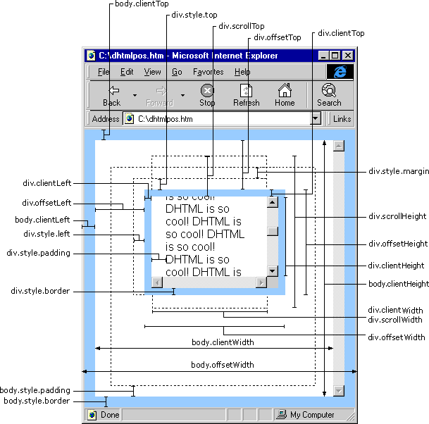
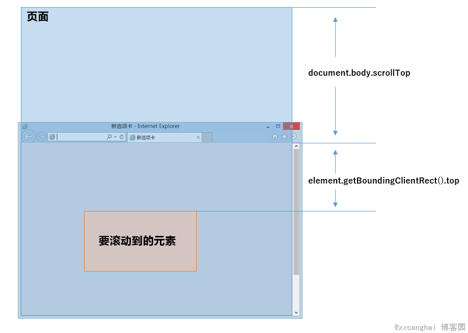
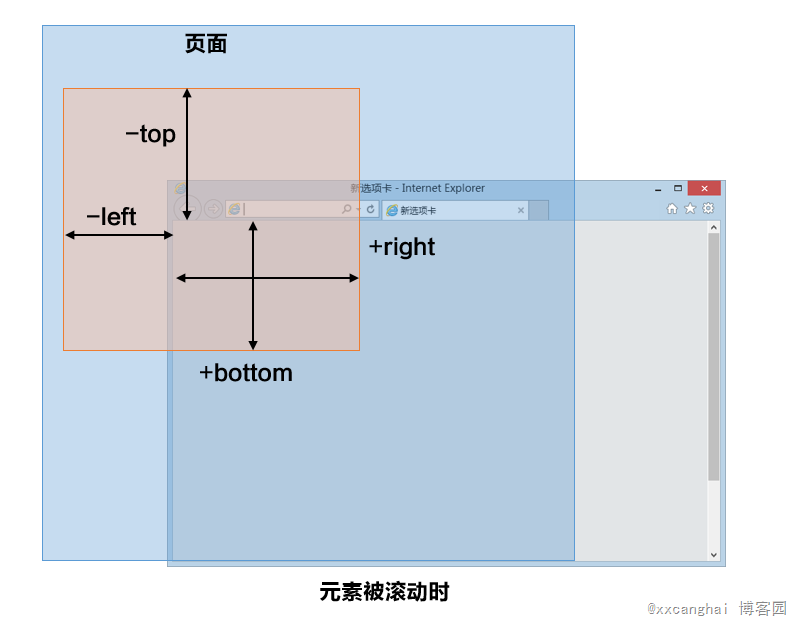
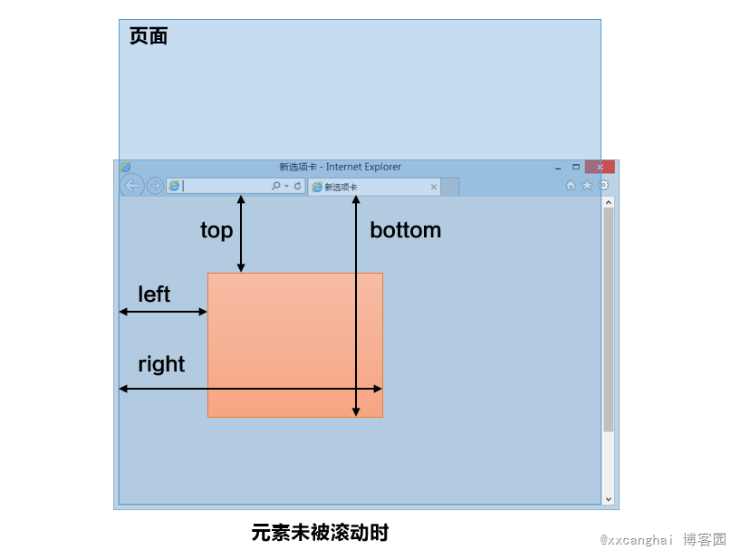

-  介绍js的基本数据类型。

	undefined、null、Boolean、Number、String、
	ECMAScript 2015 新增:Symbol(创建后独一无二且不可变的数据类型 )

-  介绍js有哪些内置对象？

	Object 是 JavaScript 中所有对象的父对象

	数据封装类对象：Object、Array、Boolean、Number 和 String
	其他对象：Function、Arguments、Math、Date、RegExp、Error

	参考：http://www.ibm.com/developerworks/cn/web/wa-objectsinjs-v1b/index.html

-  说几条写JavaScript的基本规范？

	1. 不要在同一行声明多个变量。
	2. 请使用 ===/!==来比较true/false或者数值
	3. 使用对象字面量替代new Array这种形式。
	4. 不要使用全局函数。
	5. Switch语句必须带有default分支
	6. 函数不应该有时候有返回值，有时候没有返回值。
	7. For循环必须使用大括号
	8. If语句必须使用大括号
	9. for-in循环中的变量 应该使用var关键字明确限定作用域，从而避免作用域污染。

-  JavaScript原型，原型链 ? 有什么特点？

	每个对象都会在其内部初始化一个属性，就是prototype(原型)，当我们访问一个对象的属性时，
	如果这个对象内部不存在这个属性，那么他就会去prototype里找这个属性，这个prototype又会有自己的prototype，
	于是就这样一直找下去，也就是我们平时所说的原型链的概念。
	关系：instance.constructor.prototype = instance.__proto__

	特点：
	JavaScript对象是通过引用来传递的，我们创建的每个新对象实体中并没有一份属于自己的原型副本。当我们修改原型时，与之相关的对象也会继承这一改变。

	当我们需要一个属性的时，Javascript引擎会先看当前对象中是否有这个属性， 如果没有的话，
	就会查找他的Prototype对象是否有这个属性，如此递推下去，一直检索到 Object 内建对象。

	```js
	function Func(){}
	Func.prototype.name = "Sean";
	Func.prototype.getInfo = function() {
		return this.name;
	}
	var person = new Func(); // 现在可以参考 var person = Object.create(oldObject);
	console.log(person.getInfo());//它拥有了Func的属性和方法
	// "Sean"
	console.log(Func.prototype);
	// Func { name="Sean", getInfo=function()}
	```

-  JavaScript有几种类型的值？，你能画一下他们的内存图吗？

	栈：原始数据类型（undefined，null，Boolean，Number、String）
	堆：引用数据类型（对象、数组和函数）

	两种类型的区别是：存储位置不同；
	原始数据类型直接存储在栈(stack)中的简单数据段，占据空间小、大小固定，属于被频繁使用数据，所以放入栈中存储；
	引用数据类型存储在堆(heap)中的对象,占据空间大、大小不固定。如果存储在栈中，将会影响程序运行的性能；引用数据类型在栈中存储了指针，该指针指向堆中该实体的起始地址。当解释器寻找引用值时，会首先检索其在栈中的地址，取得地址后从堆中获得实体

	
	

- 如何将字符串转化为数字，例如'12.3b'?

	* `parseFloat('12.3b')`;
	* 正则表达式，`'12.3b'.match(/(\d)+(\.)?(\d)+/g)[0] * 1`, 但是这个不太靠谱，提供一种思路而已。

- 如何将浮点数点左边的数每三位添加一个逗号，如12000000.11转化为『12,000,000.11』(用js实现千位分隔符)?

	```js
	function commafy(num){
		return num && num
			.toString()
			.replace(/(\d)(?=(\d{3})+\.)/g, function($1, $2){
				return $2 + ',';
			});
	}
	```

- 如何实现数组的随机排序？
		
	方法一：

	```js
	var arr = [1,2,3,4,5,6,7,8,9,10];
	function randSort1(arr){
		for(var i = 0,len = arr.length;i < len; i++ ){
			var rand = parseInt(Math.random()*len);
			var temp = arr[rand];
			arr[rand] = arr[i];
			arr[i] = temp;
		}
		return arr;
	}
	console.log(randSort1(arr));
	```

	方法二：

	```js
	var arr = [1,2,3,4,5,6,7,8,9,10];
	function randSort2(arr){
		var mixedArray = [];
		while(arr.length > 0){
			var randomIndex = parseInt(Math.random()*arr.length);
			mixedArray.push(arr[randomIndex]);
			arr.splice(randomIndex, 1);
		}
		return mixedArray;
	}
	console.log(randSort2(arr));
	```

	方法三：

	```js
	var arr = [1,2,3,4,5,6,7,8,9,10];
	arr.sort(function(){
		return Math.random() - 0.5;
	})
	console.log(arr);
	```

-  Javascript如何实现继承？

	1、构造继承
	2、原型继承
	3、实例继承
	4、拷贝继承

	原型prototype机制或apply和call方法去实现较简单，建议使用构造函数与原型混合方式。

	```js
	function Parent(){
		this.name = 'wang';
	}

	function Child(){
		this.age = 28;
	}

	Child.prototype = new Parent(); // 继承了Parent，通过原型

	var demo = new Child();
	alert(demo.age);
	alert(demo.name); // 得到被继承的属性
	```

- JavaScript继承的几种实现方式？
  - 参考：[构造函数的继承](http://www.ruanyifeng.com/blog/2010/05/object-oriented_javascript_inheritance.html)，[非构造函数的继承](http://www.ruanyifeng.com/blog/2010/05/object-oriented_javascript_inheritance_continued.html)；


-  javascript创建对象的几种方式？

	javascript创建对象简单的说,无非就是使用内置对象或各种自定义对象，当然还可以用JSON；但写法有很多种，也能混合使用。

	1. 对象字面量的方式

		```js
		person={firstname:"Mark",lastname:"Yun",age:25,eyecolor:"black"};
		```

	2. 用function来模拟无参的构造函数

		```js
		function Person(){}
		var person = new Person(); // 定义一个function，如果使用new"实例化",该function可以看作是一个Class
		person.name = "Mark";
		person.age = "25";
		person.work = function(){
			alert(person.name+" hello...");
		}
		person.work();
		```

	3. 用function来模拟参构造函数来实现（用this关键字定义构造的上下文属性）
		
		```js
		function Pet(name,age,hobby){
			this.name=name;//this作用域：当前对象
			this.age=age;
			this.hobby=hobby;
			this.eat=function(){
				alert("我叫"+this.name+",我喜欢"+this.hobby+",是个程序员");
			}
		}
		var maidou =new Pet("麦兜",25,"coding");//实例化、创建对象
		maidou.eat();//调用eat方法
		```


	4. 用工厂方式来创建（内置对象）

		```js
		var wcDog = new Object();
		wcDog.name = "旺财";
		wcDog.age = 3;
		wcDog.work = function(){
			alert("我是"+wcDog.name+",汪汪汪......");
		}
		wcDog.work();
		```


	5. 用原型方式来创建

		```js
		function Dog(){}
		Dog.prototype.name = "旺财";
		Dog.prototype.eat = function(){
			alert(this.name+"是个吃货");
		}
		var wangcai = new Dog();
		wangcai.eat();
		```


	6. 用混合方式来创建
		```js
		function Car (name, price) {
			this.name=name;
			this.price=price;
		}
		Car.prototype.sell = function () {
			alert("我是"+this.name+"，我现在卖"+this.price+"万元");
		}
		var camry = new Car("凯美瑞", 27);
		camry.sell();
		```

-  Javascript作用链域?

	全局函数无法查看局部函数的内部细节，但局部函数可以查看其上层的函数细节，直至全局细节。
	当需要从局部函数查找某一属性或方法时，如果当前作用域没有找到，就会上溯到上层作用域查找，
	直至全局函数，这种组织形式就是作用域链。

-  谈谈this对象的理解。

  this总是指向函数的直接调用者（而非间接调用者）；
	如果有new关键字，this指向new出来的那个对象；
	在事件中，this指向触发这个事件的对象，特殊的是，IE中的attachEvent中的this总是指向全局对象Window；

-  eval是做什么的？

	它的功能是把对应的字符串解析成JS代码并运行；
	应该避免使用eval，不安全，非常耗性能（2次，一次解析成js语句，一次执行）。
	由JSON字符串转换为JSON对象的时候可以用eval，var obj =eval('('+ str +')');

-  什么是window对象? 什么是document对象?

	window对象是指浏览器打开的窗口。
	document对象是Documentd对象（HTML 文档对象）的一个只读引用，window对象的一个属性。

-  null，undefined 的区别？

	null 		表示一个对象是“没有值”的值，也就是值为“空”；
	undefined 	表示一个变量声明了没有初始化(赋值)；

	undefined不是一个有效的JSON，而null是；
	undefined的类型(typeof)是undefined；
	null的类型(typeof)是object；

	Javascript将未赋值的变量默认值设为undefined；
	Javascript从来不会将变量设为null。它是用来让程序员表明某个用var声明的变量时没有值的。

	typeof undefined
	//"undefined"
	undefined :是一个表示"无"的原始值或者说表示"缺少值"，就是此处应该有一个值，但是还没有定义。当尝试读取时会返回 undefined；
	例如变量被声明了，但没有赋值时，就等于undefined

	typeof null
	//"object"
	null : 是一个对象(空对象, 没有任何属性和方法)；
	例如作为函数的参数，表示该函数的参数不是对象；

	注意：
	在验证null时，一定要使用　=== ，因为 == 无法分别 null 和　undefined
	null == undefined // true
	null === undefined // false

	再来一个例子：

	null
	Q：有张三这个人么？
	A：有！
	Q：张三有房子么？
	A：没有！

	undefined
	Q：有张三这个人么？
	A：有！
	Q: 张三有多少岁？
	A: 不知道（没有被告诉）

	参考阅读：[undefined与null的区别](http://www.ruanyifeng.com/blog/2014/03/undefined-vs-null.html)

-  写一个通用的事件侦听器函数。

	// event(事件)工具集
	```js
	markyun.Event = {
		// 页面加载完成后
		readyEvent: function(fn) {
			if (fn==null) {
				fn=document;
			}
			var oldonload = window.onload;
			if (typeof window.onload != 'function') {
				window.onload = fn;
			} else {
				window.onload = function() {
					oldonload();
					fn();
				};
			}
		},
		// 视能力分别使用dom0||dom2||IE方式 来绑定事件
		// 参数： 操作的元素,事件名称 ,事件处理程序
		addEvent : function(element, type, handler) {
			if (element.addEventListener) {
				//事件类型、需要执行的函数、是否捕捉
				element.addEventListener(type, handler, false);
			} else if (element.attachEvent) {
				element.attachEvent('on' + type, function() {
					handler.call(element);
				});
			} else {
				element['on' + type] = handler;
			}
		},
		// 移除事件
		removeEvent : function(element, type, handler) {
			if (element.removeEventListener) {
				element.removeEventListener(type, handler, false);
			} else if (element.datachEvent) {
				element.detachEvent('on' + type, handler);
			} else {
				element['on' + type] = null;
			}
		},
		// 阻止事件 (主要是事件冒泡，因为IE不支持事件捕获)
		stopPropagation : function(ev) {
			if (ev.stopPropagation) {
				ev.stopPropagation();
			} else {
				ev.cancelBubble = true;
			}
		},
		// 取消事件的默认行为
		preventDefault : function(event) {
			if (event.preventDefault) {
				event.preventDefault();
			} else {
				event.returnValue = false;
			}
		},
		// 获取事件目标
		getTarget : function(event) {
			return event.target || event.srcElement;
		},
		// 获取event对象的引用，取到事件的所有信息，确保随时能使用event；
		getEvent : function(e) {
			var ev = e || window.event;
			if (!ev) {
				var c = this.getEvent.caller;
				while (c) {
					ev = c.arguments[0];
					if (ev && Event == ev.constructor) {
						break;
					}
					c = c.caller;
				}
			}
			return ev;
		}
	};
	```

-  事件是？IE与火狐的事件机制有什么区别？ 如何阻止冒泡？

	1. 我们在网页中的某个操作（有的操作对应多个事件）。例如：当我们点击一个按钮就会产生一个事件。是可以被 JavaScript 侦测到的行为。
	2. 事件处理机制：IE是事件冒泡、Firefox同时支持两种事件模型，也就是：捕获型事件和冒泡型事件；
	3. ev.stopPropagation();（旧ie的方法 ev.cancelBubble = true;）


-  什么是闭包（closure），为什么要用它？

	闭包是指有权访问另一个函数作用域中变量的函数，创建闭包的最常见的方式就是在一个函数内创建另一个函数，通过另一个函数访问这个函数的局部变量,利用闭包可以突破作用链域，将函数内部的变量和方法传递到外部。

	闭包的特性：

	1. 函数内再嵌套函数
	2. 内部函数可以引用外层的参数和变量
	3. 参数和变量不会被垃圾回收机制回收

	li节点的onclick事件都能正确的弹出当前被点击的li索引

	```html
		<ul id="testUL">
				<li> index = 0</li>
				<li> index = 1</li>
				<li> index = 2</li>
				<li> index = 3</li>
		</ul>
	<script type="text/javascript">
		var nodes = document.getElementsByTagName("li");
		for(i = 0; i< nodes.length; i+= 1){
			nodes[i].onclick = (function(i){
				return function() {
					console.log(i);
				} // 不用闭包的话，值每次都是4
			})(i);
		}
	</script>
	```

	执行say667()后,say667()闭包内部变量会存在,而闭包内部函数的内部变量不会存在
	使得Javascript的垃圾回收机制GC不会收回say667()所占用的资源
	因为say667()的内部函数的执行需要依赖say667()中的变量
	这是对闭包作用的非常直白的描述

	```js
	function say667() {
	// Local variable that ends up within closure
	var num = 666;
	var sayAlert = function() {
		alert(num);
	}
	num++;
	return sayAlert;
	}

	var sayAlert = say667();
	sayAlert()//执行结果应该弹出的667
	```


-  javascript 代码中的"use strict";是什么意思 ? 使用它区别是什么？

	use strict是一种ECMAscript 5 添加的（严格）运行模式,这种模式使得 Javascript 在更严格的条件下运行,

	使JS编码更加规范化的模式,消除Javascript语法的一些不合理、不严谨之处，减少一些怪异行为。
	默认支持的糟糕特性都会被禁用，比如不能用with，也不能在意外的情况下给全局变量赋值;
	全局变量的显示声明,函数必须声明在顶层，不允许在非函数代码块内声明函数,arguments.callee也不允许使用；
	消除代码运行的一些不安全之处，保证代码运行的安全,限制函数中的arguments修改，严格模式下的eval函数的行为和非严格模式的也不相同;

	提高编译器效率，增加运行速度；
	为未来新版本的Javascript标准化做铺垫。

-  如何判断一个对象是否属于某个类？

	使用instanceof （待完善）

	```js
	if(a instanceof Person){
			alert('yes');
	}
	```

-  new操作符具体干了什么呢?

	1. 创建一个空对象，并且 this 变量引用该对象，同时还继承了该函数的原型。
	2. 属性和方法被加入到 this 引用的对象中。
	3. 新创建的对象由 this 所引用，并且最后隐式的返回 this 。

	```js
	var obj  = {};
	obj.__proto__ = Base.prototype;
	Base.call(obj);
	```

-  用原生JavaScript的实现过什么功能吗？

	swipe、tplify、requireify、vueify

-  Javascript中，有一个函数，执行时对象查找时，永远不会去查找原型，这个函数是？

	hasOwnProperty

	javaScript中hasOwnProperty函数方法是返回一个布尔值，指出一个对象是否具有指定名称的属性。此方法无法检查该对象的原型链中是否具有该属性；该属性必须是对象本身的一个成员。
	使用方法：
	object.hasOwnProperty(proName)
	其中参数object是必选项。一个对象的实例。
	proName是必选项。一个属性名称的字符串值。

	如果 object 具有指定名称的属性，那么JavaScript中hasOwnProperty函数方法返回 true，反之则返回 false。

-  JSON 的了解？

	JSON(JavaScript Object Notation) 是一种轻量级的数据交换格式。
	它是基于JavaScript的一个子集。数据格式简单, 易于读写, 占用带宽小
	如：{"age":"12", "name":"back"}

	JSON字符串转换为JSON对象:
	var obj =eval('('+ str +')');
	var obj = str.parseJSON();
	var obj = JSON.parse(str);

	JSON对象转换为JSON字符串：
	var last=obj.toJSONString();
	var last=JSON.stringify(obj);

-  `[].forEach.call($$("*"),function(a){a.style.outline="1px solid #"+(~~(Math.random()*(1<<24))).toString(16)})` 能解释一下这段代码的意思吗？


-  js延迟加载的方式有哪些？

		defer和async、动态创建DOM方式（用得最多）、按需异步载入js

-  Ajax 是什么? 如何创建一个Ajax？

	ajax的全称：Asynchronous Javascript And XML。
	异步传输+js+xml。
	所谓异步，在这里简单地解释就是：向服务器发送请求的时候，我们不必等待结果，而是可以同时做其他的事情，等到有了结果它自己会根据设定进行后续操作，与此同时，页面是不会发生整页刷新的，提高了用户体验。

	(1)创建XMLHttpRequest对象,也就是创建一个异步调用对象
	(2)创建一个新的HTTP请求,并指定该HTTP请求的方法、URL及验证信息
	(3)设置响应HTTP请求状态变化的函数
	(4)发送HTTP请求
	(5)获取异步调用返回的数据
	(6)使用JavaScript和DOM实现局部刷新

- Ajax 解决浏览器缓存问题？

	1. 在ajax发送请求前加上 anyAjaxObj.setRequestHeader("If-Modified-Since","0")。
	2. 在ajax发送请求前加上 anyAjaxObj.setRequestHeader("Cache-Control","no-cache")。
	3. 在URL后面加上一个随机数： "fresh=" + Math.random();。
	4. 在URL后面加上时间戳："nowtime=" + new Date().getTime();。
	5. 如果是使用jQuery，直接这样就可以了 $.ajaxSetup({cache:false})。这样页面的所有ajax都会执行这条语句就是不需要保存缓存记录。

-  同步和异步的区别?

	同步的概念应该是来自于OS中关于同步的概念:不同进程为协同完成某项工作而在先后次序上调整(通过阻塞,唤醒等方式).同步强调的是顺序性.谁先谁后.异步则不存在这种顺序性.

	同步：浏览器访问服务器请求，用户看得到页面刷新，重新发请求,等请求完，页面刷新，新内容出现，用户看到新内容,进行下一步操作。

	异步：浏览器访问服务器请求，用户正常操作，浏览器后端进行请求。等请求完，页面不刷新，新内容也会出现，用户看到新内容。

	（待完善）

-  如何解决跨域问题?

	jsonp、 iframe、window.name、window.postMessage、服务器上设置代理页面

-  页面编码和被请求的资源编码如果不一致如何处理？

-  服务器代理转发时，该如何处理cookie？

	nginx
	

-  模块化开发怎么做？

	[ 立即执行函数](http://benalman.com/news/2010/11/immediately-invoked-function-expression/),不暴露私有成员

	```js
	var module1 = (function(){
		var _count = 0;
		var m1 = function(){
			//...
		};
		var m2 = function(){
			//...
		};
		return {
			m1 : m1,
			m2 : m2
		};
	})();
	```

	（待完善）

-  AMD（Modules/Asynchronous-Definition）、CMD（Common Module Definition）规范区别？

	> AMD 规范在这里：https://github.com/amdjs/amdjs-api/wiki/AMD

	> CMD 规范在这里：https://github.com/seajs/seajs/issues/242

	Asynchronous Module Definition，异步模块定义，所有的模块将被异步加载，模块加载不影响后面语句运行。所有依赖某些模块的语句均放置在回调函数中。

	区别：

	1. 对于依赖的模块，AMD 是提前执行，CMD 是延迟执行。不过 RequireJS 从 2.0 开始，也改成可以延迟执行（根据写法不同，处理方式不同）。CMD 推崇 as lazy as possible.
	2. CMD 推崇依赖就近，AMD 推崇依赖前置。看代码：
	```js
	// CMD
	define(function(require, exports, module) {
			var a = require('./a')
			a.doSomething()
			// 此处略去 100 行
			var b = require('./b') // 依赖可以就近书写
			b.doSomething()
			// ...
	})

	// AMD 默认推荐
	define(['./a', './b'], function(a, b) { // 依赖必须一开始就写好
			a.doSomething()
			// 此处略去 100 行
			b.doSomething()
			// ...
	})
	```

-  requireJS的核心原理是什么？（如何动态加载的？如何避免多次加载的？如何
缓存的？）

	参考：http://annn.me/how-to-realize-cmd-loader/

-  JS模块加载器的轮子怎么造，也就是如何实现一个模块加载器？

	1. id即路径 原则

		通常我们的入口是这样的： require( [ 'a', 'b' ], callback ) 。这里的 'a'、'b' 都是 ModuleId。通过 id 和路径的对应原则，加载器才能知道需要加载的 js 的路径。在这个例子里，就是 baseUrl + 'a.js' 和 baseUrl + 'b.js'。
		
		但 id 和 path 的对应关系并不是永远那么简单，比如在 AMD 规范里就可以通过配置 Paths  来给特定的 id 指配 path。

	2. createElement('script') & appendChild

		知道路径之后，就需要去请求。一般是通过 createElement('script') & appendChild 去请求。这个大家都知道，不多说。有时候有的加载器也会通过 AJAX 去请求脚本内容。
		
		一般来说，需要给 <script> 设置一个属性用来标识模块 id, 作用后面会提到。

	3. document.currentScript/script.onload

		a.js 里可能是 define( id, factory ) 或者是 define( factory )，后者被称为匿名模块。那么当 define(factory) 被执行的时候，我们怎么知道当前被定义的是哪个模块呢，具体地说，这个匿名模块的实际模块 id 是什么？ 答案是通过 document.currentScript 获取当前执行的<script>，然后通过上面给 script 设置的属性来得到模块 id。
		
		需要注意的是，低级浏览器是不支持 currentScript 的，这里需要进行浏览器兼容。在高级浏览器里面，还可以通过 script.onload 来处理这个事情。

	4. 依赖分析

		在继续讲之前，需要先简单介绍下模块的生命周期。模块在被 Define 之后并不是马上可以用了，在你执行它的 factory 方法来生产出最终的 export 之前，你需要保证它的依赖是可用的。那么首先就要先把依赖分析出来。

		简单来说，就是通过 toString 这个方法得到 factory 的内容，然后用正则去匹配其中的 require( 'moduleId' )。当然也可以不用正则。

		这就是为什么 require( var );  这种带变量的语句是不被推荐的，因为它会影响依赖分析。如果一定要用变量，可以用 require( [ var ] ) 这种异步加载的方式。

	5. 递归加载
		在分析出模块的依赖之后，我们需要递归去加载依赖模块。用伪代码来表达大概是这样的：
		```js
		Module.prototype.load = function () {
			var deps = this.getDeps();
			for (var i = 0; i < deps.length; i++) {
				var m = deps[i];
				if (m.state < STATUS.LOADED) {
					m.load();
				}
			}
			this.state = STATUS.LOADED;
		}
		```

		上面的代码只是表达一个意思，实际上 load 方法很可能是异步的，所以递归的返回要特殊处理下。

	实现一个可用的加载器并没有那么简单，比如你要处理循环依赖，还有各种各样的牵一发动全身的细节。但要说原理，大概就是这么几条。个人觉得，比起照着规范实现一个加载器，更加吸引人的是 AMD 或者 CommonJS 这些规范的完善和背后的设计思路。

-  谈一谈你对ECMAScript6的了解？

	即ECMAScript 2015，ECMAScript是JavaScript语言的国际标准，JavaScript是ECMAScript的实现。

-  ECMAScript6 怎么写class么，为什么会出现class这种东西?

  ```js
	//定义类
	class Point {
		constructor(x, y) {
			this.x = x;
			this.y = y;
		}

		toString() {
			return '(' + this.x + ', ' + this.y + ')';
		}
	}

	// 继承类
	class ColorPoint extends Point {
		constructor(x, y, color) {
			super(x, y); // 调用父类的constructor(x, y)
			this.color = color;
		}

		toString() {
			return this.color + ' ' + super.toString(); // 调用父类的toString()
		}
	}
	```
	只是语法糖

-  异步加载JS的方式有哪些？

	1. defer，只支持IE
	1. async
	1. 创建script，插入到DOM中，加载完毕后callBack

- document.write和 innerHTML的区别

	document.write只能重绘整个页面

	innerHTML可以重绘页面的一部分

- DOM操作——怎样添加、移除、移动、复制、创建和查找节点?

	1. 创建新节点
		createDocumentFragment()    //创建一个DOM片段
		createElement()   //创建一个具体的元素
		createTextNode()   //创建一个文本节点
	1. 添加、移除、替换、插入
		appendChild()
		removeChild()
		replaceChild()
		insertBefore() //在已有的子节点前插入一个新的子节点
	1. 查找
		getElementsByTagName()    //通过标签名称
		getElementsByName()    //通过元素的Name属性的值(IE容错能力较强，会得到一个数组，其中包括id等于name值的)
		getElementById()    //通过元素Id，唯一性

-  数组和对象有哪些原生方法，列举一下？
	- 数组
		concat(arrayX,arrayX,......,arrayX) 用于连接两个或多个数组
		constructor 构造器
			arguments
			caller
			from
			isArray
			length
			name
			of
			prototype
			Symbol(Symbol.species)
			get Symbol(Symbol.species)
			__proto__
			[[Scopes]]
		copyWithin(target, start, end) 从数组的指定位置拷贝元素到数组的另一个指定位置中
		entries() 返回一个迭代器，它返回数组的键/值对
		every(function(currentValue,index,arr), thisValue) 检测数组所有元素是否都符合指定条件（通过函数提供）
		fill(value, start, end) 将一个固定值替换数组的元素。
		filter(function(currentValue,index,arr), thisValue) 创建一个新的数组，新数组中的元素是通过检查指定数组中符合条件的所有元素。
		find(callback[, thisArg])  返回传入一个测试条件（函数）符合条件的数组第一个元素。
		findIndex(function(currentValue, index, arr), thisValue) 返回传入一个测试条件（函数）符合条件的数组第一个元素位置。
		forEach(function(currentValue, index, arr), thisValue) 调用数组的每个元素，并将元素传递给回调函数。
		includes(searchElement, fromIndex) 判断一个数组是否包含一个指定的值，根据情况，如果包含则返回 true，否则返回false。
		indexOf(item,start) 返回某个指定的字符串值在字符串中首次出现的位置
		join(separator) 把数组中的所有元素转换一个字符串。
		keys() 返回一个新Array Iterator对象，其中包含数组中每个索引的键。
		lastIndexOf(item,start) 返回一个指定的字符串值最后出现的位置，在一个字符串中的指定位置从后向前搜索
		length 返回数组长度
		map(function(currentValue,index,arr), thisValue) 返回一个新数组，数组中的元素为原始数组元素调用函数处理后的值。
		pop() 删除并返回数组的最后一个元素。
		push(item1, item2, ..., itemX) 向数组的末尾添加一个或多个元素，并返回新的长度
		reduce(function(total, currentValue, currentIndex, arr), initialValue) 接收一个函数作为累加器，数组中的每个值（从左到右）开始缩减，最终计算为一个值
		reduceRight(function(total, currentValue, currentIndex, arr), initialValue)  接收一个函数作为累加器，数组中的每个值（从右到左）开始缩减，最终计算为一个值
		reverse() 颠倒数组中元素的顺序
		shift() 把数组的第一个元素从其中删除，并返回第一个元素的值
		slice(start, end) 从已有的数组中返回选定的元素
		some(function(currentValue,index,arr),thisValue) 检测数组中的元素是否满足指定条件（函数提供）。
		sort(compareFunction) 对数组的元素进行排序,并返回数组
		splice(index,howmany,item1,.....,itemX) 插入、删除或替换数组的元素
		toLocaleString() 把数组转换为本地数组，并返回结果
		toString() 把数组转换为字符串，并返回结果，每一项以逗号分割。
		unshift(item1,item2, ..., itemX) 向数组的开头添加一个或更多元素，并返回新的长度
		valueOf() 返回数组本身
		Symbol(Symbol.iterator) 
		Symbol(Symbol.unscopables)
		__proto__
	- 对象
		hasOwnProperty(key) 判断某个对象在排除原型链的情况下是否含有指定的自身属性
		isPrototypeOf(obj) 检查一个对像是否存在另一个对象的原型链上
		propertyIsEnumerable(key) 检测属性是否可用 for...in 枚举
		toLocaleString() 把对象转换为本地字符串，并返回结果。
		toString() 把对象转换为字符串，并返回结果。
		valueOf() 返回最适合该对象类型的原始值
		__defineGetter__
		__defineSetter__
		__lookupGetter__
		__lookupSetter__
		get __proto__
		set __proto__

-  JavaScript中的作用域与变量声明提升？
	- JS只有两类作用域：全局作用域、函数作用域。
		- 全局作用域：全局对象的作用域，在代码的任何地方都可访问，但有时会被函数作用域覆盖
		- 函数作用域：作用于整个函数范围内，不管到底是在函数中的何处进行声明
	```js
	// 全局变量
	var i = 100;
	// 函数声明，outer是一个外部函数
	function outer(){
			// 访问全局变量
			console.log(i);  // 100
			// 函数声明，inner是一个内部函数
			function inner(){
					// 内部函数的内部进行了变量提升，也就是第二部分叙述的内容
					console.log(i);  // undefined
					// 这里的i是局部变量，作用域仅在函数内
					var i = 1;
					// 局部变量覆盖全局变量，或者说是函数作用域覆盖全局作用域
					console.log(i);  // 1
			}
			inner();
			// 这里的i是全局变量
			console.log(i);  // 100
	}
	outer();
	```

	- 变量提升
		```js
		var date = new Date();
		function fn(){
				console.log(date);
				if(true){
						var date = 'hello';
				}
		}
		fn();
		```

		结果并不是date的toString方法返回的结果，而是undefined，因为以上代码等价于：

		```js
		// 变量声明提升
		var date;
		date = new Date();
		function fn(){
				// 变量声明提升，但是此时未定义变量的值
				var date;
				console.log(date);
				if(true){
						date = "hello";
				}
		}
		fn();
		```

		[拓展](https://www.jianshu.com/p/d4bde266e06d)

-  如何编写高性能的Javascript？

	- 使用局部变量
	- 避免增长作用域链
	- 字符串链接优化
	- 条件判断
	- 快速循环
	- 展开循环
	- 高效存取数据
	-	事件委托
	
	[拓展](https://www.cnblogs.com/MarcoHan/p/5315361.html)

-  那些操作会造成内存泄漏？

	内存泄漏指任何对象在您不再拥有或需要它之后仍然存在。
	垃圾回收器定期扫描对象，并计算引用了每个对象的其他对象的数量。如果一个对象的引用数量为 0（没有其他对象引用过该对象），或对该对象的惟一引用是循环的，那么该对象的内存即可回收。

	setTimeout 的第一个参数使用字符串而非函数的话，会引发内存泄漏。
	闭包、控制台日志、循环（在两个对象彼此引用且彼此保留时，就会产生一个循环）

	- 全局变量引起的内存泄漏
	- 闭包引起的内存泄漏
	- dom清空或删除时，事件未清除导致的内存泄漏

	[拓展](http://www.ruanyifeng.com/blog/2017/04/memory-leak.html)

-  JQuery的源码看过吗？能不能简单概况一下它的实现原理？

-  jQuery.fn的init方法返回的this指的是什么对象？为什么要返回this？

	* init这里是jQuery类的成员方法，jQuery类被实例化后this指向被拥有的jQuery实例,jQuery对象本身就是个类数组对象
	* 为了完成jQuery链式操作，都需要返回this

-  jQuery 的属性拷贝(extend)的实现原理是什么，如何实现深拷贝？

```js
	function extend() {
		// 重载 (目标对象，源对象)/extend(boolean，目标对象，源对象)
		var options, name, src, copy, copyIsArray, clone,
			target = arguments[0] || {},
			i = 1,
			length = arguments.length,
			deep = false,
			isPlainObject =  function isPlainObject( obj ) {
				var proto, Ctor,
				hasOwn = {}.hasOwnProperty,
				fnToString = hasOwn.toString,
				getProto = Object.getPrototypeOf,
				toString = {}.toString,
				ObjectFunctionString = fnToString.call( Object );

				// Detect obvious negatives
				// Use toString instead of jQuery.type to catch host objects
				if ( !obj || toString.call( obj ) !== "[object Object]" ) {
					return false;
				}

				proto = getProto( obj );

				// Objects with no prototype (e.g., `Object.create( null )`) are plain
				if ( !proto ) {
					return true;
				}

				// Objects with prototype are plain iff they were constructed by a global Object function
				Ctor = hasOwn.call( proto, "constructor" ) && proto.constructor;
				return typeof Ctor === "function" && fnToString.call( Ctor ) === ObjectFunctionString;
			},
			isFunction = function isFunction(obj) {
				return typeof obj === "function" && typeof obj.nodeType !== "number";
			};

		// 处理深拷贝情况
		if ( typeof target === "boolean" ) {
			deep = target;

			// 跳过布尔值和目标
			target = arguments[i] || {};
			i++;
		}

		// 当目标是字符串或其他时（可能是深拷贝）
		if ( typeof target !== "object" && !isFunction(target) ) {
			target = {};
		}

		// 如果只传递一个参数，则扩展jQuery本身。
		if ( i === length ) {
			target = this;
			i--;
		}

		for ( ; i < length; i++ ) {

			// 只处理非空/未定义的值。
			if ( ( options = arguments[ i ] ) != null ) {

				// 扩展基对象
				for ( name in options ) {
					src = target[ name ];
					copy = options[ name ];

					// 防止无限循环
					if ( target === copy ) {
						continue;
					}

					// 如果我们合并普通对象或数组则递归
					if ( deep && copy && ( isPlainObject( copy ) ||
						( copyIsArray = Array.isArray( copy ) ) ) ) {

						if ( copyIsArray ) {
							copyIsArray = false;
							clone = src && Array.isArray( src ) ? src : [];

						} else {
							clone = src && isPlainObject( src ) ? src : {};
						}

						// 不要移动原始对象，克隆它们
						target[ name ] = extend( deep, clone, copy );

					// 不要引入未定义的值。
					} else if ( copy !== undefined ) {
						target[ name ] = copy;
					}
				}
			}
		}

		// 返回修改对象
		return target;
	};
```
-  jquery.extend 与 jquery.fn.extend的区别？

	* jquery.extend 为jquery类添加类方法，可以理解为添加静态方法
	* jquery.fn.extend:
	源码中jquery.fn = jquery.prototype，所以对jquery.fn的扩展，就是为jquery类添加成员函数
	使用：
	jquery.extend扩展，需要通过jquery类来调用，而jquery.fn.extend扩展，所有jquery实例都可以直接调用。

-  jQuery 的队列是如何实现的？队列可以用在哪些地方？

-  谈一下Jquery中的bind(),live(),delegate(),on()的区别？

-  JQuery一个对象可以同时绑定多个事件，这是如何实现的？

-  是否知道自定义事件。jQuery里的fire函数是什么意思，什么时候用？

-  jQuery 是通过哪个方法和 Sizzle 选择器结合的？（jQuery.fn.find()进入Sizzle）

-  针对 jQuery性能的优化方法？

-  Jquery与jQuery UI 有啥区别？

	* jQuery是一个js库，主要提供的功能是选择器，属性修改和事件绑定等等。

	* jQuery UI则是在jQuery的基础上，利用jQuery的扩展性，设计的插件。
			提供了一些常用的界面元素，诸如对话框、拖动行为、改变大小行为等等

-  jquery 中如何将数组转化为json字符串，然后再转化回来？

jQuery中没有提供这个功能，所以你需要先编写两个jQuery的扩展：

		$.fn.stringifyArray = function(array) {
		    return JSON.stringify(array)
		}

		$.fn.parseArray = function(array) {
		    return JSON.parse(array)
		}

		然后调用：
		$("").stringifyArray(array)

-  jQuery和Zepto的区别？各自的使用场景？

	jQuery 由于强大的生命力基本上是一个事实标准，所以大部分工具 lib 在 DOM 操作、动画等功能上或多或少都会是 jQuery-like 的。
	
	Zepto 的 API 就是完全兼容 jQuery 的，功能上 Zepto 是 jQuery 的子集，定位上 jQuery 桌面为主，Zepto 则从一开始就定位移动设备，所以体积方面有一定优势。
	
	也就是说如果你只用了 jQuery 很少且都是核心的功能，比如选择器等，那么可以在不改动任何业务代码的情况下把 lib 切换到 Zepto——其实就是把 $ 对象换掉了。

 * Zepto更轻量级
 * Zepto是jQuery的精简，针对移动端去除了大量jQuery的兼容代码
 * 部分API的实现方式不同

-  针对 jQuery 的优化方法？

	* 基于Class的选择性的性能相对于Id选择器开销很大，因为需遍历所有DOM元素。

	* 频繁操作的DOM，先缓存起来再操作。用Jquery的链式调用更好。
		比如：var str=$("a").attr("href");

	* for (var i = size; i < arr.length; i++) {}
		for 循环每一次循环都查找了数组 (arr) 的.length 属性，在开始循环的时候设置一个变量来存储这个数字，可以让循环跑得更快：
		for (var i = size, length = arr.length; i < length; i++) {}

-  Zepto的点透问题如何解决？

	引入fastclick.js

	点透的出现场景可以总结如下：

	1. A/B两个层上下z轴重叠。

	2. 上层的A点击后消失或移开。（这一点很重要）

	3. B元素本身有默认click事件（如a标签） 或 B绑定了click事件。

	在以上情况下，点击A/B重叠的部分，就会出现点透的现象。

	为什么会出现点透
	
	click延迟，延迟，还是延迟。

	在移动端不使用click而用touch事件代替触摸是因为click事件有着明显的延迟

	touchstart 早于 touchend 早于 click。亦即click的触发是有延迟的，这个时间大概在300ms左右。

-  需求：实现一个页面操作不会整页刷新的网站，并且能在浏览器前进、后退时正确响应。给出你的技术实现方案？

	单页面SPA方案

- 如何判断当前脚本运行在浏览器还是node环境中？

	this === window ? 'browser' : 'node';

	通过判断Global对象是否为window，如果不为window，当前脚本没有运行在浏览器中

-  移动端最小触控区域是多大？

	Android的最小点击区域尺寸是48x48dp，苹果的标准是44pt x 44pt 

-  jQuery 的 slideUp动画 ，如果目标元素是被外部事件驱动, 当鼠标快速地连续触发外部元素事件, 动画会滞后的反复执行，该如何处理呢?

		jquery stop(): 如：$("#div").stop().animate({width:"100px"},100);

-  把 Script 标签 放在页面的最底部的body封闭之前 和封闭之后有什么区别？浏览器会如何解析它们？

	浏览器加载一个有 <script> 标签的网站发生的事情:

	1. 拉取 HTML 页面 (e.g. index.html)
	2. 开始解析 HTML
	3. 解析到 <script> 标签之后准备获取 script 文件.
	4. 浏览器获取script文件。同时，html 解析中断并且阻断页面上其他html的解析。
	5. 一段时间后，script下载完成并且执行。
	6. 继续解析HTML文档的其他部分（解析script之后的html代码）

	第4步导致了不好的用户体验，直到script文件全部下载完成之前HTML都不能得到解析。

	- 为什么会发生阻断事件?

		任何script代码都能改变HTML的结构，通过document.write() 这种方式或者其他方式。 
		
		这就导致了HTML解析必须等待script全部被下载和执行完，HTML才能解析script标签之后余下的部分。
		
		然而，大部分的Javascript开发者在加载文档过程中，不会通过script操作HTML的DOM结构。
		
		然而，他们必须等到script全部加载结束，才能看到页面。
	
	- 解决方案

		之前推荐的方法（已过时）：
		
		之前解决这个问题的方法是把<script> 标签放到<body>标签之后 ，这确保了解析到</body>之前都不会被script终端。
		
		这个方法是有问题的: 浏览器在整个文档解析完成之前都不能下载script文件，如果文档很大的话，解析完HTML，用户依然要等待script文件下载并执行完成之后，才能操作这个网站。（主要是串行，先解析HTML完，再下载并执行script，速度肯定没有并行块，那么怎么并行呢？我们假设能在解析HTML一开始，就开始下载script，并且不阻断HTML的解析，是不是就并行了呢）如果你的网站在2秒之内没有响应，用户就会跑掉；

		现在推荐的解决方案：现在浏览器script标签支持 async 和 defer 属性. 应用这些属性当script被下载时，浏览器更安全而且可以并行下载（下载script并不阻断HTML解析）。

		```html
		<script type="text/javascript" src="path/to/script1.js" async></script>
		<script type="text/javascript" src="path/to/script2.js" async></script>
		```

		async标记的Script异步执行下载，并执行。这意味着script下载时并不阻塞HTML的解析，并且下载结束script马上执行。
		
		异步意味着，上述代码script2可能比script1先下载完并执行完。

		```html
		<script type="text/javascript" src="path/to/script1.js" defer></script>
		<script type="text/javascript" src="path/to/script2.js" defer></script>
		```

		defer标签的script顺序执行。这种方式也不会阻断浏览器解析HTML。
		
		跟 async不同, defer scripts在整个文档里的script都被下载完才顺序执行。

		[拓展](https://zhuanlan.zhihu.com/p/30558018)

-  移动端的点击事件的有延迟，时间是多久，为什么会有？ 怎么解决这个延时？（click 有 300ms 延迟,为了实现safari的双击事件的设计，浏览器要知道你是不是要双击操作。）

		click 与 tap 的区别 待拓展
		
		click有300s延迟性，可能会点击穿透。

		使用touch事件来替换click事件。

		用fastclick

		tap 其实是touch事件的扩展

-  知道各种JS框架(Angular, Backbone, Ember, React, Meteor, Knockout...)么? 能讲出他们各自的优点和缺点么?

-  Underscore 对哪些 JS 原生对象进行了扩展以及提供了哪些好用的函数方法？

-  JQuery一个对象可以同时绑定多个事件，这是如何实现的？

		* 多个事件同一个函数：
			$("div").on("click mouseover", function(){});
		* 多个事件不同函数
			$("div").on({
				click: function(){},
				mouseover: function(){}
			});

-  Node.js的适用场景？

-  (如果会用node)知道route, middleware, cluster, nodemon, pm2, server-side rendering么?

-  解释一下 Backbone 的 MVC 实现方式？

- 什么是“前端路由”?什么时候适合使用“前端路由”? “前端路由”有哪些优点和缺点?

- 知道什么是webkit么? 知道怎么用浏览器的各种工具来调试和debug代码么?

		Chrome,Safari浏览器内核。

- 如何测试前端代码么? 知道BDD, TDD, Unit Test么? 知道怎么测试你的前端工程么(mocha, sinon, jasmin, qUnit..)?

- 前端templating(Mustache, underscore, handlebars)是干嘛的, 怎么用?

- 简述一下 Handlebars 的基本用法？

- 简述一下 Handlerbars 的对模板的基本处理流程， 如何编译的？如何缓存的？

- 检测浏览器版本版本有哪些方式？

		功能检测、userAgent特征检测

		比如：navigator.userAgent
		//"Mozilla/5.0 (Macintosh; Intel Mac OS X 10_10_2) AppleWebKit/537.36
		  (KHTML, like Gecko) Chrome/41.0.2272.101 Safari/537.36"

- What is a Polyfill?

	polyfill 是“在旧版浏览器上复制标准 API 的 JavaScript 补充”,可以动态地加载 JavaScript 代码或库，在不支持这些标准 API 的浏览器中模拟它们。
	例如，geolocation（地理位置）polyfill 可以在 navigator 对象上添加全局的 geolocation 对象，还能添加 getCurrentPosition 函数以及“坐标”回调对象，
	所有这些都是 W3C 地理位置 API 定义的对象和函数。因为 polyfill 模拟标准 API，所以能够以一种面向所有浏览器未来的方式针对这些 API 进行开发，
	一旦对这些 API 的支持变成绝对大多数，则可以方便地去掉 polyfill，无需做任何额外工作。

- 做的项目中，有没有用过或自己实现一些 polyfill 方案（兼容性处理方案）？

	比如： html5shiv、Geolocation、Placeholder

- 我们给一个dom同时绑定两个点击事件，一个用捕获，一个用冒泡。会执行几次事件，会先执行冒泡还是捕获？

- 使用JS实现获取文件扩展名？

	function getFileExtension(filename) {
		return filename.slice((filename.lastIndexOf(".") - 1 >>> 0) + 2);
	}

	String.lastIndexOf() 方法返回指定值（本例中的'.'）在调用该方法的字符串中最后出现的位置，如果没找到则返回 -1。
	对于'filename'和'.hiddenfile'，lastIndexOf的返回值分别为0和-1无符号右移操作符(»>) 将-1转换为4294967295，将-2转换为4294967294，这个方法可以保证边缘情况时文件名不变。
	String.prototype.slice() 从上面计算的索引处提取文件的扩展名。如果索引比文件名的长度大，结果为""。

- Webpack热更新实现原理?

		1. Webpack编译期，为需要热更新的 entry 注入热更新代码(EventSource通信)
		2. 页面首次打开后，服务端与客户端通过 EventSource 建立通信渠道，把下一次的 hash 返回前端
		3. 客户端获取到hash，这个hash将作为下一次请求服务端 hot-update.js 和 hot-update.json的hash
		4. 修改页面代码后，Webpack 监听到文件修改后，开始编译，编译完成后，发送 build 消息给客户端
		5. 客户端获取到hash，成功后客户端构造hot-update.js script链接，然后插入主文档
		6. hot-update.js 插入成功后，执行hotAPI 的 createRecord 和 reload方法，获取到 Vue 组件的 render方法，重新 render 组件， 继而实现 UI 无刷新更新。

- 请介绍一下JS之事件节流？

- 什么是JS的函数防抖？

# ECMAScript6 相关

- Object.is() 与原来的比较操作符“ ===”、“ ==”的区别？

		两等号判等，会在比较时进行类型转换；
		三等号判等(判断严格)，比较时不进行隐式类型转换,（类型不同则会返回false）；

		Object.is 在三等号判等的基础上特别处理了 NaN 、-0 和 +0 ，保证 -0 和 +0 不再相同，
		但 Object.is(NaN, NaN) 会返回 true.

 		Object.is 应被认为有其特殊的用途，而不能用它认为它比其它的相等对比更宽松或严格。

- ES6是如何实现编译成ES5的？

- css-loader的原理？
 
## IOS中input键盘事件keyup、keydown、keypress支持不是很好
 
问题是这样的，用input search做模糊搜索的时候，在键盘里面输入关键词，会通过ajax后台查询，然后返回数据，然后再对返回的数据进行关键词标红。用input监听键盘keyup事件，在安卓手机浏览器中是可以的，但是在ios手机浏览器中变红很慢，用输入法输入之后，并未立刻相应keyup事件，只有在通过删除之后才能相应！
 
可以用html5的oninput事件去代替keyup
 
```js
document.getElementById('id').addEventListener('input', function(e){ })
```

## 移动端 HTML5 audio autoplay 失效问题
 
这个不是 BUG，由于自动播放网页中的音频或视频，会给用户带来一些困扰或者不必要的流量消耗，所以苹果系统和安卓系统通常都会禁止自动播放和使用 JS 的触发播放，必须由用户来触发才可以播放。
解决方法思路：先通过用户 touchstart 触碰，触发播放并暂停（音频开始加载，后面用 JS 再操作就没问题了）。
 
```js
document.addEventListener('touchstart', function () { 
    document.getElementsByTagName('audio')[0].play()
    document.getElementsByTagName('audio')[0].pause() 
})
```

## 唤起select的option展开
 
```js
function showDropdown(sltElement) {
  var event;
  event = document.createEvent('MouseEvents')
  event.initMouseEvent('mousedown', true, true, window)
  sltElement.dispatchEvent(event)
}
```
 
# 关于DOM级别
 
[待拓展](http://www.cnblogs.com/hyaaon/p/4623613.html)
 
> DOM0级标准是不存在的，所谓的DOM0级是DOM历史坐标中的一个参照点而已
 
0. DOM0级指的是IE4和Netscape 4.0这些浏览器最初支持的DHTML
1. DOM1级（DOM Level 1）于1998年10月成为W3C的推荐标准。DOM1级由两个模块组成：DOM核心（DOM Core）和DOM HTML。其中，DOM核心规定的是如何映射基于XML的文档结构，以便简化对文档中任意部分的访问和操作。DOM HTML模块则在DOM核心的基础上加以扩展，添加了针对HTML的对象和方法。
2. DOM2级在原来DOM的基础上又扩充了（DHTML一直都支持的）鼠标和用户界面事件、范围、遍历（迭代DOM文档的方法）等细分模块，而且通过对象接口增加了对CSS（Cascading Style Sheets，层叠样式表）的支持。DOM1级中的DOM核心模块也经过扩展开始支持XML命名空间
3. DOM3级则进一步扩展了DOM，引入了以统一方式加载和保存文档的方法–在DOM加载和保存（DOM Load and Save）模块中定义；新增了验证文档的方法–在DOM验证（DOM Validation）模块中定义。DOM3级也对DOM核心进行了扩展，开始支持XML 1.0规范，涉及XML Infoset、XPath和XML Base。
 
# 事件模型及事件代理/委托
 
## 事件流
 
DOM2级事件模型中规定了事件流的三个阶段：捕获阶段、目标阶段、冒泡阶段，低版本IE（IE8及以下版本）不支持捕获阶段
 
* 捕获事件流：Netscape提出的事件流，即事件由页面元素接收，逐级向下，传播到最具体的元素。
 
* 冒泡事件流：IE提出的事件流，即事件由最具体的元素接收，逐级向上，传播到页面。
 
* 目前支持以addEventListener绑定事件的浏览器：FF、Chrome、Safari、Opera、IE9-11
 
* 目前支持以attachEvent绑定事件的浏览器：IE6-10
 
> 综合测试结果，preventDefault和returnValue的兼容性如下（T：支持该属性或事件且结果正确；F：不支持该属性或事件或结果不正确：—：不支持该事件绑定方式）
 
|函数名|    事件绑定方式    |事件流|    FF|    Chrome|    Opera|    Safari|    模拟IE8|    模拟IE9|    模拟IE10|    IE11|
|:--:|:--:|:--:|:--:|:--:|:--:|:--:|:--:|:--:|:--:|:--:|
|preventDetault()|    element.on[type] = fn|    冒泡|    T|    T    |T|    T|    F|    T|    T|    T|
||addEventListener()|    捕获|    T|    T|    T|    T|    —|    T|    T|    T|
|||冒泡|    T    |T    |T|    T    |—    |T|    T|    T|
||attachEvent()    |冒泡    |—    |—|    —|    —|    F|    F|    F|    —|
|returnValue=false|    element.on[type] = fn|    冒泡|    F|    T    |T|    T|    T|    F|    F|    F|
||addEventListener()|    捕获    |F|    T|    T|    T    |—    |F    |F    |F|
|||冒泡|    F|    T|    T|    T|    —|    F    |F|    F|
||attachEvent()|    冒泡|    —|    —|    —    |—|    T|    F|    F|    —|
 
## IE和W3C不同绑定事件解绑事件的方法有什么区别，参数分别是什么，以及事件对象e有什么区别
 
W3C：`target.addEventListener(event, listener, useCapture);`
 
`event`事件类型；`listener`事件触发时执行的函数；`useCapture`指定事件是否在捕获或冒泡阶段执行，为true时事件句柄在捕获阶段执行，为`false`（默认`false`）时，事件句柄在冒泡阶段执行。
 
```js
btn.addEventListener('click', function() {
//do something...
}, false)
```
 
对应的事件移除
 
```js
removeEventListener(event, function, capture/bubble)
```
 
IE：`target.attachEvent(type, listener);`
 
`type`字符串，事件名称，含`on`，比如`onclick`、`onmouseover`、`onkeydown`等。 `listener`实现了 `EventListener` 接口或者是 JavaScript 中的函数。
 
```js
btn.attachEvent('onclick', function() {
//do something...
})
```
 
对应的事件移除

```js
detachEvent(event, function)
```
 
## 事件的委托（代理 Delegated Events）的原理以及优缺点
 
委托（代理）事件是那些被绑定到父级元素的事件，但是只有当满足一定匹配条件时才会被挪。这是靠事件的冒泡机制来实现的，优点是：
 
1. 可以大量节省内存占用，减少事件注册，比如在table上代理所有td的click事件就非常棒
2. 可以实现当新增子对象时无需再次对其绑定事件，对于动态内容部分尤为合适
 
缺点是：
 
1. 事件代理的应用常用应该仅限于上述需求下，如果把所有事件都用代理就可能会出现事件误判，即本不应用触发事件的被绑上了事件
 
例子：
 
```js
var toolbar = document.querySelector(".toolbar");
toolbar.addEventListener("click", function(e) {
  var button = e.target;
  if(!button.classList.contains("active"))
    button.classList.add("active");
  else
    button.classList.remove("active");
});
```
 
## 手写原生js实现事件代理，并要求兼容浏览器
 
```js
// ============ 简单的事件委托
function delegateEvent(interfaceEle, selector, type, fn) {
    if(interfaceEle.addEventListener){
    interfaceEle.addEventListener(type, eventfn);
    }else{
    interfaceEle.attachEvent("on"+type, eventfn);
    }
     
    function eventfn(e){
    var e = e || window.event;    
    var target = e.target || e.srcElement;
    if (matchSelector(target, selector)) {
            if(fn) {
                fn.call(target, e);
            }
        }
    }
}
/**
* only support #id, tagName, .className
* and it's simple single, no combination
*/
function matchSelector(ele, selector) {
    // if use id
    if (selector.charAt(0) === "#") {
        return ele.id === selector.slice(1);
    }
    // if use class
    if (selector.charAt(0) === ".") {
        return (" " + ele.className + " ").indexOf(" " + selector.slice(1) + " ") != -1;
    }
    // if use tagName
    return ele.tagName.toLowerCase() === selector.toLowerCase();
}
//调用
var odiv = document.getElementById("oDiv");
delegateEvent(odiv,"a","click",function(){
    alert("1");
})
```
 
## 实现事件模型`events`
 
大致实现思路就是创建一个类或是匿名函数，在bind和trigger函数外层作用域创建一个字典对象，用于存储注册的事件及响应函数列表，bind时，如果字典没有则创建一个，key是事件名称，value是数组，里面放着当前注册的响应函数，如果字段中有，那么就直接push到数组即可。trigger时调出来依次触发事件响应函数即可。
 
```js
var Emitter=function(){
    this._listeners = {} }
//注册事件
Emitter.prototype.on = function(eventName, callback) {
     var listeners = this._listeners[eventName]||[]
     listeners.push(callback)
     this._listeners[eventName]=listeners
}
//触发事件
Emitter.prototype.emit = function(eventName) {
    var args = Array.prototype.slice.apply(arguments).slice(1),
        listeners = this._listeners[eventName],
        self = this
    if (!Array.isArray(listeners))
        return
    listeners.forEach(function(callback) {
        try{
            callback.apply(this,args)
        } catch(e) {
            console.error(e)
        } 
    })
}
//实例
var emitter = new Emitter()
emitter.on('event', function(arg1, arg2){
    console.log('get event',arg1,arg2)
})
console.log('emit event')
emitter.emit('event', 'arg1', 'arg2')
```
 
## 事件如何派发也就是事件广播（dispatchEvent）
 
一般我们在元素上绑定事件后，是靠用户在这些元素上的鼠标行为来捕获或者触发事件的，或者自带的浏览器行为事件，比如click，mouseover，load等等，有些时候我们需要自定义事件或者在特定的情况下需要触发这些事件。这个时候我们可以使用IE下fireEvent方法，高级浏览器（chrome,firefox等）有dispatchEvent方法。
 
ie下的例子：
 
```js
//document上绑定自定义事件ondataavailable
document.attachEvent('ondataavailable', function (event) {
    alert(event.eventType);
});
var obj=document.getElementById("obj");
//obj元素上绑定click事件
obj.attachEvent('onclick', function (event) {
alert(event.eventType);
});
//调用document对象的createEventObject方法得到一个event的对象实例。
var event = document.createEventObject();
event.eventType = 'message';
//触发document上绑定的自定义事件ondataavailable
document.fireEvent('ondataavailable', event);
//触发obj元素上绑定click事件
document.getElementById("test").onclick = function () {
    obj.fireEvent('onclick', event);
};
```
 
高级浏览器（chrome,firefox等）的例子：
 
```js
//document上绑定自定义事件ondataavailable
document.addEventListener('ondataavailable', function (event) {
    alert(event.eventType);
}, false);
var obj = document.getElementById("obj");
//obj元素上绑定click事件
obj.addEventListener('click', function (event) {
    alert(event.eventType);
}, false);
//调用document对象的 createEvent 方法得到一个event的对象实例。
var event = document.createEvent('HTMLEvents');
// initEvent接受3个参数：
// 事件类型，是否冒泡，是否阻止浏览器的默认行为
event.initEvent("ondataavailable", true, true);
event.eventType = 'message';
//触发document上绑定的自定义事件ondataavailable
document.dispatchEvent(event);
var event1 = document.createEvent('HTMLEvents');
event1.initEvent("click", true, true);
event1.eventType = 'message';
//触发obj元素上绑定click事件
document.getElementById("test").onclick = function () {
    obj.dispatchEvent(event1);
};
 
```

 
## Array的栈和队列
 
* 使用`push()`和`pop()`模拟栈
* 使用`push()`和`shift()`模拟队列
* 使用`unshift()`和`pop()`模拟反向队列
 
* `push()` 将参数插入队尾
* `pop()` 删除队尾的参数
* `shift()` 删除队首的参数
* `unshift()` 将参数插入队首
 
## 闭包

闭包就是
能够读取其他函数内部变量的函数
定义在一个函数内部的函数
将函数内部和函数外部连接起来的一座桥梁

广义上的闭包就是指一个变量在他自身作用域外被使用了，就叫发生了闭包
 
函数中的this指向执行该函数的对象，如果没有对象，则指向全局对象。
 
 
call/apply/bind
 
```js
(obj1.)fn.call(obj2,a1,a2,a3...)//obj2没有提供，则默认为Global对象
(obj1.)fn.apply(obj2,[a1,a2,a3...])//obj2没有提供，则默认为Global对象，且无法传递参数
(obj1.)fn.bind(obj2)(a1,a2,a3...) //bind的返回值是函数,call//apply则是立即执行
(obj1.)fn.bind(obj2,a1,a2)(a1,a2,a3... ) //bind返回绑定默认参数/绑定执行对象的方法，默认参数/执行对象在后来执行时不会被替换(a1,a2不会被替换，a3...则可以)
obj2.fn(a1,a2,a3...)
 
(fn./Function.prototype.)bind.apply(fn1,[obj1,a1,a2,a3...])
fn1.bind(obj1,a1,a2,a3... )
 
```
 


## 关于prototype、constructor、__proto__、类、继承(es6)
 
Javascript中的继承一直是个比较麻烦的问题，prototype、constructor、__proto__在构造函数，实例和原型之间有的复杂的关系，不仔细捋下很难记得牢固。ES6中又新增了class和extends，和ES5搅在一起，加上平时很少自己写继承，简直乱成一锅粥。不过还好，画个图一下就清晰了，下面不说话了，直接上图，上代码。
 
### es5 中的继承
 

 
ES5中这种最简单的继承，实质上就是将子类的原型设置为父类的实例。
 
```js
function Super() {} 
function Sub() {}
Sub.prototype = new Super();
Sub.prototype.constructor = Sub;
 
var sub = new Sub();
 
 
Sub.prototype.constructor === Sub; // ② true
sub.constructor === Sub; // ④ true
sub.__proto__ === Sub.prototype; // ⑤ true
Sub.prototype.__proto__ == Super.prototype; // ⑦ true
```
 
### es6 中的继承
 

 
ES6和ES5的继承是一模一样的，只是多了class 和extends ，ES6的子类和父类，子类原型和父类原型，通过__proto__ 连接。
 
```js
class Super {} 
class Sub extends Super {}
 
var sub = new Sub();
  
Sub.prototype.constructor === Sub; // ② true
sub.constructor === Sub; // ④ true
sub.__proto__ === Sub.prototype; // ⑤ true
Sub.__proto__ === Super; // ⑥ true
Sub.prototype.__proto__ === Super.prototype; // ⑦ true
```
 

## TouchEvent里的targetTouches、touches、changedTouches的区别的具体体现是？
 
* touches:当前屏幕上所有触摸点的集合列表
* targetTouches: 绑定事件的那个结点上的触摸点的集合列表
* changedTouches: 触发事件时改变的触摸点的集合
 
举例来说，比如div1, div2只有div2绑定了touchstart事件，第一次放下一个手指在div2上，触发了touchstart事件，这个时候，三个集合的内容是一样的，都包含这个手指的touch，然后，再放下两个手指一个在div1上，一个在div2上，这个时候又会触发事件，但changedTouches里面只包含第二个第三个手指的信息，因为第一个没有发生变化，而targetTouches包含的是在第一个手指和第三个在div2上的手指集合，touches包含屏幕上所有手指的信息，也就是三个手指
 
## 页面元素的坐标获取
 

 

 

 

 
获取或直接设定当前页面滚动高度：
 
$(document).scrollTop();//获取，兼容火狐谷歌
 
有动画效果的设定当前页面滚动高度：
 
$("body,html").animate({ scrollTop: ... });//动画滚动效果，兼容火狐谷歌


# 发布-订阅模式/观察者模式

- 在观察者模式中，观察者是知道Subject的，Subject一直保持对观察者进行记录。然而，在发布订阅模式中，发布者和订阅者不知道对方的存在。它们只有通过消息代理进行通信。
- 在发布订阅模式中，组件是松散耦合的，正好和观察者模式相反，是紧耦合的。
- 观察者模式大多数时候是同步的，比如当事件触发，Subject就会去调用观察者的方法。而发布-订阅模式大多数时候是异步的（使用消息队列）。
- 观察者模式需要在单个应用程序地址空间中实现，而发布-订阅更像交叉应用模式。


## ios中对 body绑定click事件不触发

```js
  document.body.addEventListner('click',function(){
     // do something
   }, false);

   // change the onclick

  <body onclick="handleClick(event)"></body>
   function handleClick(){
      // do something
   }
   // not trigger the  handleClick
```

# Javascript异步编程
[](http://www.ruanyifeng.com/blog/2012/12/asynchronous%EF%BC%BFjavascript.html)

Javascript语言的执行环境是"单线程"（single thread）。

就是指一次只能完成一件任务。如果有多个任务，就必须排队，前面一个任务完成，再执行后面一个任务，以此类推，此为同步（Synchronous）。

我们可以通过其他方法来做到异步（Asynchronous）。


## 回调函数

setTimeout会将f1推迟执行，f1执行完后调用回调函数callback。

```js
function f1 (callback){
	 setTimeout(function () {
		// f1的任务代码
		typeof callback == "function" && callback();
	}, 1000);
}
f1(f2);
```

## 事件监听

采用事件驱动模式。任务的执行不取决于代码的顺序，而取决于某个事件是否发生。

- 优点是比较容易理解，可以绑定多个事件，每个事件可以指定多个回调函数，而且可以"去耦合"（Decoupling），有利于实现模块化。
- 缺点是整个程序都要变成事件驱动型，运行流程会变得很不清晰。

```js
// 为f1绑定一个事件，当f1发生done事件，就执行f2。
f1.on('done', f2);

function f1(){
	setTimeout(function () {

		// f1的任务代码

		// 执行完成后，立即触发done事件，从而开始执行f2。
		f1.trigger('done');
	}, 1000);
}
```

## 发布/订阅

上一节的"事件"，完全可以理解成"信号"。

这种方法的性质与"事件监听"类似，但是明显优于后者。因为我们可以通过查看"消息中心"，了解存在多少信号、每个信号有多少订阅者，从而监控程序的运行。

我们假定，存在一个"信号中心"，某个任务执行完成，就向信号中心"发布"（publish）一个信号，其他任务可以向信号中心"订阅"（subscribe）这个信号，从而知道什么时候自己可以开始执行。这就叫做"发布/订阅模式"（publish-subscribe pattern），又称"观察者模式"（observer pattern）

```js
// f2向"信号中心"jQuery订阅"done"信号
jQuery.subscribe("done", f2);

function f1(){
	setTimeout(function () {
		// f1的任务代码

		// f1执行完成后，向"信号中心"jQuery发布"done"信号，从而引发f2的执行
		jQuery.publish("done");
	}, 1000);
}

// f2完成执行后，也可以取消订阅（unsubscribe）
jQuery.unsubscribe("done", f2);
```

## Promises对象

es6已实现的新规范，是目前异步编程的最优解。

```js
function f1 () {
  return new Promise((resolve, reject) => {
		// f1的任务代码

		resolve() // 成功
		reject() // 发生错误
  })
}

可以指定多个回调函数，并指定发生错误时的回调函数
f1().then(f2).then(f3).catch(f4);
```

## 总结

可以看得出前三种方法采用的基本原理都是使用`setTimeout`，将函数推迟执行；而最后一个`Promise`则不同于。它们之前的区别见事件循环。

# 事件循环

要理解如何异步编程就必须理解js的事件循环

## 栈 Stack

当我们调用一个函数，它的地址、参数、局部变量都会压入到一个 stack 中，并且是后进先出。

## 微任务/宏任务 （Microtasks Macrotasks）

- microtasks:
	- process.nextTick
	- promise
	- Object.observe
- macrotasks:
	- setTimeout
	- setInterval
	- setImmediate
	- I/O

在一个事件循环的周期(cycle)中一个 (macro)task 应该从 macrotask 队列开始执行。当这个 macrotask 结束后，所有的 microtasks 将在同一个 cycle 中执行。在 microtasks 执行时还可以加入更多的 microtask，然后一个一个的执行，直到 microtask 队列清空。

```js
console.log('start')

const interval = setInterval(() => {  
  console.log('setInterval')
}, 0)

setTimeout(() => {  
  console.log('setTimeout 1')
  Promise.resolve()
      .then(() => {
        console.log('promise 3')
      })
      .then(() => {
        console.log('promise 4')
      })
      .then(() => {
        setTimeout(() => {
          console.log('setTimeout 2')
          Promise.resolve()
              .then(() => {
                console.log('promise 5')
              })
              .then(() => {
                console.log('promise 6')
              })
              .then(() => {
                clearInterval(interval)
              })
        }, 0)
      })
}, 0)

Promise.resolve()
    .then(() => {  
        console.log('promise 1')
    })
    .then(() => {
        console.log('promise 2')
    })
/*
输出

start
promise 1
promise 2
setInterval
setTimeout 1
promise 3
promise 4
setInterval
setTimeout 2
promise 5
promise 6

解读

Cycle 1
1) setInterval 被列为 task

2) setTimeout 1 被列为 task

3) Promise.resolve 1 中两个 then 被列为 microtask

4) stack 清空 microtasks 执行

任务队列： setInterval setTimeout 1

Cycle 2
5) microtasks 队列清空 setInteval 的回调可以执行。另一个 setInterval 被列为 task , 位于 setTimeout 1 后面

任务队列： setTimeout 1 setInterval

Cycle 3
6) microtask 队列清空，setTimeout 1 的回调可以执行，promise 3 和 promise 4 被列为 microtasks

7) promise 3 和 promise 4 执行。 setTimeout 2 被列为 task

任务队列 setInterval setTimeout 2

Cycle 4
8) microtask 队列清空 setInteval 的回调可以执行。然后另一个 setInterval 被列为 task ，位于 setTimeout 2 后面

任务队列： setTimeout 2 setInterval

9) setTimeout 2 的回调执行， promise 5 和 promise 6 被列为 microtasks

现在 promise 5 和 promise 6 的回调应该执行，并且 clear 掉 interval。 但有的时候不知道为什么 setInterval 还会在执行一遍，变成下面结果
*/
```

## 规范

- 一个事件循环(event loop)会有一个或多个任务队列(task queue) task queue 就是 macrotask queue
- 每一个 event loop 都有一个 microtask queue
- task queue == macrotask queue != microtask queue
- 一个任务 task 可以放入 macrotask queue 也可以放入 microtask queue 中
- 当一个 task 被放入队列 queue(macro或micro) 那这个 task 就可以被立即执行了

## 概念

js 只有一个main thread 主进程和call-stack（一个调用堆栈），所以在对一个调用堆栈中的task处理的时候，其他的都要等着。task等待被加入调用堆栈等待执行的时候，被放在task queue事件队列之中。
每当主线程完成一个任务的时候，他就会去调用堆栈中获取task执行。

- macrotask：也称为task，包含了script(整体代码),setTimeout, setInterval, setImmediate, I/O, UI rendering
- microtask：process.nextTick, Promises, Object.observe, MutationObserver

JavaScript引擎首先从macrotask queue中取出第一个任务，执行完毕后，将microtask queue中的所有任务取出，按顺序全部执行；
然后再从macrotask queue中取下一个，执行完毕后，再次将microtask queue中的全部取出；
循环往复，直到两个queue中的任务都取完。

# Reflect/Object.defineProperty()
 
> Object.defineProperty(obj, prop, descriptor)
 
```js
// 使用 __proto__
Object.defineProperty(obj, "key", {
  __proto__: null, // 没有继承的属性
  value: "static"  // 没有 enumerable
                   // 没有 configurable
                   // 没有 writable
                   // 作为默认值
});
 
// 显式
Object.defineProperty(obj, "key", {
  enumerable: false,
  configurable: false,
  writable: false,
  value: "static"
});
 
// 循环使用同一对象
function withValue(value) {
  var d = withValue.d || (
    withValue.d = {
      enumerable: false,
      writable: false,
      configurable: false,
      value: null
    }
  );
  d.value = value;
  return d;
}
// ... 并且 ...
Object.defineProperty(obj, "key", withValue("static"));
 
// 如果 freeze 可用, 防止代码添加或删除对象原型的属性
// （value, get, set, enumerable, writable, configurable）
(Object.freeze||Object)(Object.prototype);
```

如何取消微信下拉浏览器头部动画
	1. 用touch事件代替滑动
	2. 在onscroll中阻止默认事件
	
SPA单页面和微信支付的bug
微信支付需要配置一个支付授权目录，你需要将项目中的支付地址置于该配置之下，支付方能成功

微信对其支付授权目录的配置规则描述如下：
	1. 所有使用公众号支付方式发起支付请求的链接地址，都必须在支付授权目录之下；
	2. 最多设置3个支付授权目录，且域名必须通过ICP备案；
	3. 头部要包含http或https，须细化到二级或三级目录，以左斜杠“/”结尾。
 
当单页面History模式使用hash模式时，页面的路径为 xxx.com/index.html#/login
 
微信的检查逻辑：取到URL后用最后一个'/'做分隔符，将URL分为两部分，用第一部分和配置的支付授权目录做比对，匹配则验证成功，否则验证失败。很显然，这种验证方式下，URL分隔后的第一部分会包含哈希，于是验证失败。
 
解决办法：在#前加个?,因为?后面的字符串会被当做查询参数而忽视。xxx.com/index.html?#/login

## 奇奇怪怪的用法

```js
//取整
parseInt(a,10); //Before
Math.floor(a); //Before
a>>0; //Before
~~a; //After
a|0; //After

//四舍五入
Math.round(a); //Before
a+.5|0; //After

//内置值
undefined; //Before
void 0; //After, 快
0[0]; //After, 略慢

//内置值
Infinity;
1/0;

//布尔值短写法
true; //Before
!0; //After

//布尔值短写法
false; //Before
!1; //After
```